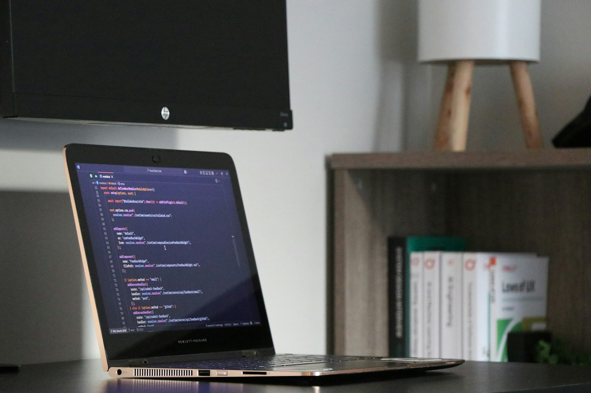

# StudyShop

[](https://openjdk.org/)
[](https://spring.io/projects/spring-boot)
[](https://kafka.apache.org/)
[](https://www.mongodb.com/)
[](https://grpc.io/)
[](https://react.dev/)
[](https://docs.docker.com/compose/)
[](https://playwright.dev/)
[](docs/academia-qa/README.md)
[-lightgrey)](#duas-portas-de-entrada-escolha-a-sua)

<p align="center">
  
</p>

<p align="center"><em>Você não precisa chegar motivado todo dia. A trilha existe para te segurar nos dias frouxos.</em></p>

Você chegou. Não precisa fingir que já entende microserviços, Kafka ou gRPC.

Este projeto começou pequeno e ganhou outro tamanho: não é só “suba o Docker e clique”. É um **laboratório de e-commerce** (o StudyShop) feito para QA e para quem quer **entender o que está acontecendo** — tela, API, banco, mensagens, segurança, traces — e, se quiser, **reconstruir algo parecido do zero**.

Não é produção. Senhas e segredos são de lab. O objetivo é aprender sem medo de errar.

## Por que isto existe (e por que compartilhar)

Eu montei e estudei isto a partir do zero. Quero que outras pessoas tenham **a mesma chance** — amigos, colegas, quem nunca abriu um Compose.

Nem todo mundo é automotivado. Esperar “disciplina infinita” exclui gente boa. Por isso a academia tem **ordem, diagramas, sessões curtas, pistas e critérios de “termineí”**: o caminho carrega quem ainda não carrega sozinho.

<p align="center">
  
</p>

Estude sozinho ou em dupla. Combine um horário. Se travar, anote o que tentou — isso também conta.

---

## Duas portas de entrada (escolha a sua)

### 1) Quero só rodar e ver funcionar

Fica nesta página, na seção [Subir com Docker Compose](#subir-com-docker-compose).

| Passo | O quê |
|-------|--------|
| Subir | `.\scripts\up.ps1` (Windows) ou `./scripts/up.sh` (Linux/WSL) |
| Abrir a loja | http://localhost:11000 — login `qa` / `qa123` |
| Ver se está vivo | http://localhost:11001/api/health |
| Smoke rápido | `.\scripts\smoke.ps1` ou `./scripts/smoke.sh` |
| Derrubar | `.\scripts\down.ps1` ou `./scripts/down.sh` |

Comandos na mão (sem script): [docs/comandos-linux-wsl.md](docs/comandos-linux-wsl.md). Cenários de clique: [docs/cenarios-qa.md](docs/cenarios-qa.md).

### 2) Quero estudar de verdade (do zero, com calma)

Não comece pela tabela de portas. Comece pela academia:

**→ [docs/academia-qa/README.md](docs/academia-qa/README.md)**

São **12 semanas**, cerca de **8–10 horas por semana**. Cada sessão tem o próprio arquivo (meta, lab, leitura ou diagrama). Você implementa, vê com a mão, valida o fluxo, automatiza e só então evolui. O ritmo é lento de propósito: quem ainda não domina a stack não deveria ler um único markdown “nível 3” e achar que entendeu.

Neste caminho, **este repositório é o oráculo** (a prova dos nove: o sistema pronto). O código que você escreve do zero fica numa pasta irmã, `studyshop-do-zero`, para não misturar com o lab.

Como estudar sem se perder: [docs/academia-qa/como-estudar.md](docs/academia-qa/como-estudar.md).

<p align="center">
  
</p>

---

## O que você está mexendo (em português)

Imagine uma loja simples. O browser fala com uma **API única** (gateway). Por trás, vários serviços pequenos:

| Peça | O que é | Por que existe no lab |
|------|---------|------------------------|
| **web** | Tela React | Onde o QA “usa o produto” |
| **api-gateway** | Porta HTTP + login | Onde o Bruno/curl entram; esconde o gRPC |
| **orders / inventory / payments / notifications** | Serviços Java | Cada um com seu papel e, em geral, seu banco |
| **MongoDB** | Documentos | O dado depois que a API respondeu |
| **Kafka** | Eventos (não é “fila Rabbit” aqui) | O pedido anda em etapas; você vê isso na Kafka UI |
| **Jaeger / Prometheus / Grafana** | Trace, métrica, painel | Quando “funcionou” mas você quer saber *por onde* |
| **Bruno + smoke + Playwright** | Teste manual e automático | Do clique ao script que não mente |

Mapa e portas: [docs/arquitetura.md](docs/arquitetura.md). Palavras novas: [docs/glossario.md](docs/glossario.md).

**Ferramentas para olhar por dentro** (depois que a stack subiu): Kafka UI http://localhost:11016 · Swagger http://localhost:11001/swagger-ui.html · Jaeger http://localhost:11011 · guia por ferramenta em [docs/academia-qa/ferramentas/](docs/academia-qa/ferramentas/).

---

## Info extra (vale saber antes de se assustar)

- Coisas que parecem “bug” às vezes são **limitação didática** (ex.: estoque que não volta após falha de pagamento). Lista: [docs/academia-qa/riscos-conhecidos.md](docs/academia-qa/riscos-conhecidos.md).
- A academia fala de **Quartz, webhook, DLQ** etc. Parte disso você **constrói** no projeto do zero; o oráculo nem sempre tem.
- Segurança em três momentos (JWT → Keycloak → mTLS): [docs/seguranca.md](docs/seguranca.md).
- Índice de tudo em docs: [docs/README.md](docs/README.md).
- Fotos do topo: [docs/assets/CREDITOS.md](docs/assets/CREDITOS.md) (Unsplash).

Se travar: leia o diagrama do lab, as pistas no fim do arquivo, a fonte oficial linkada — e anote o que tentou. Isso também é estudo.

## O que tem no lab (stack)
| Área | Tecnologia |
|------|------------|
| Backend | Java / Spring Boot |
| Contratos internos | gRPC (Protobuf) |
| Eventos | Apache Kafka (KRaft) |
| Dados | MongoDB 7 |
| API HTTP | api-gateway (REST + health) |
| Frontend | React + Vite |
| Local | Docker Compose |
| Kubernetes | Helm umbrella `study-shop` |
| Observabilidade | OTel → Jaeger / Prometheus / Grafana |
| API client | Bruno (`bruno/study-shop`) |

## Documentação (referência)

Use depois de escolher a porta de entrada acima. A academia já aponta para a maioria destes arquivos na hora certa.

- [Academia QA — 12 semanas](docs/academia-qa/README.md)
- [Comandos Linux/WSL](docs/comandos-linux-wsl.md)
- [Arquitetura](docs/arquitetura.md)
- [Segurança (JWT + OIDC + mTLS)](docs/seguranca.md)
- [Tutorial JWT local](docs/tutoriais/01-jwt-local.md)
- [Tutorial OIDC/Keycloak](docs/tutoriais/02-oidc-keycloak.md)
- [Tutorial mTLS gRPC](docs/tutoriais/03-mtls-grpc.md)
- [Glossário](docs/glossario.md)
- [Status do pedido (saga)](docs/status-pedido.md)
- [Cenários de QA + data-testid](docs/cenarios-qa.md)
- [Observabilidade](docs/observabilidade.md)
- [Helm chart](infra/helm/study-shop/README.md)

## Pré-requisitos

- Docker Engine + Compose v2 (Linux/WSL) ou Docker Desktop (Windows/Mac)
- `curl` e, de preferência, `jq` (smoke/API)
- (Opcional) scripts: Bash **ou** PowerShell 7+
- (Opcional) JDK 21+, Maven, Node 20+ para build local
- (Opcional) kind/minikube + Helm 3 para K8s

## Subir com Docker Compose

### Linux / WSL (recomendado para aprender os comandos)

Leia e pratique: **[docs/comandos-linux-wsl.md](docs/comandos-linux-wsl.md)**.

Comando principal:

```bash
cd infra
docker compose up -d --build
```

Atalhos:

```bash
chmod +x scripts/*.sh
./scripts/up.sh
./scripts/smoke.sh
./scripts/down.sh
./scripts/down.sh --volumes
```

### Windows (PowerShell)

```powershell
.\scripts\up.ps1
.\scripts\smoke.ps1
.\scripts\down.ps1
.\scripts\down.ps1 -Volumes
```

### URLs

Portas sequenciais a partir de **11000** (evita conflito com outros projetos locais).

| Serviço | URL / porta |
|---------|-------------|
| Web | http://localhost:11000 |
| API Gateway | http://localhost:11001 |
| Health | http://localhost:11001/api/health |
| Swagger UI | http://localhost:11001/swagger-ui.html |
| Orders HTTP / gRPC | 11002 / 11003 |
| Inventory HTTP / gRPC | 11004 / 11005 |
| Payments | 11006 |
| Notifications | 11007 |
| MongoDB (host) | 11008 |
| Kafka (host) | 11009 |
| Kafka UI | http://localhost:11016 |
| Keycloak | http://localhost:11015 (overlay OIDC) |
| Grafana | http://localhost:11010 (`admin` / `admin`) |
| Jaeger | http://localhost:11011 |
| Prometheus | http://localhost:11012 |
| OTel gRPC / HTTP | 11013 / 11014 |

## API rápida

```http
POST /api/auth/login
GET  /api/health
GET  /api/products
POST /api/orders
GET  /api/orders/{orderId}
PUT  /api/products/{productId}/stock   # role ADMIN
```

Login (Momento 1):

```json
{ "username": "qa", "password": "qa123" }
```

Envie `Authorization: Bearer <accessToken>` nas rotas protegidas.

Usuários seed: `qa`/`qa123` (USER), `admin`/`admin123` (ADMIN).

Exemplo de pedido:

```json
{
  "customerEmail": "qa@studyshop.local",
  "forcePaymentFailure": false,
  "items": [{ "productId": "prod-mouse", "quantity": 1 }]
}
```

Coleção Bruno: pasta `bruno/study-shop/` (rode `login` antes). Trilha de segurança: [docs/seguranca.md](docs/seguranca.md).

## Helm (kind / minikube)

```powershell
cd infra/helm/study-shop
helm dependency update
helm install study-shop . -n study-shop --create-namespace

kubectl port-forward -n study-shop svc/api-gateway 11001:11001
kubectl port-forward -n study-shop svc/web 11000:80
```

Build/load das imagens: ver [infra/helm/study-shop/README.md](infra/helm/study-shop/README.md).

## Estrutura do repositório

```
apps/
  api-gateway/
  orders-service/
  inventory-service/
  payments-service/
  notifications-service/
  web/
libs/
  proto/
infra/
  docker-compose.yml
  helm/study-shop/
  observability/
docs/
bruno/study-shop/
scripts/
  up.sh / down.sh / smoke.sh
  up.ps1 / down.ps1 / smoke.ps1
```

## Licença / uso

Material para estudos e laboratório de QA. Ajuste imagens, senhas e hardening antes de qualquer uso real.