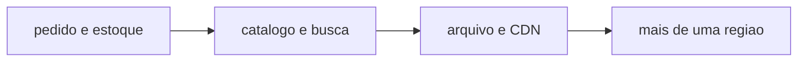

# Depois das 12 semanas — problema maior

Isto não é tarefa da semana 12. É o próximo ciclo, se você quiser.

StudyShop é pedido e estoque. Uma plataforma de vídeo é outro problema: arquivo grande, catálogo, busca, perfil, recomendação, várias regiões. O método é o mesmo: implementar um recorte, ver com a ferramenta certa, integrar por um id, automatizar, medir.

| Problema | Risco de teste | O que medir |
|----------|----------------|-------------|
| Catálogo grande | busca vazia ou lenta | p95 da busca |
| Arquivo de vídeo | upload incompleto | taxa de conclusão |
| Recomendação | lista vazia para usuário novo | fallback |
| Multi-região | dado atrasado | lag e erro |

Não copie a arquitetura do e-commerce e chame de streaming. Copie o ciclo de estudo.
