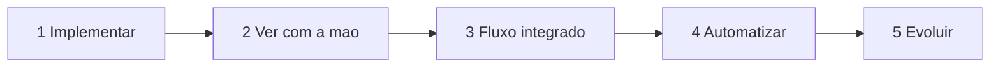

# Ciclo das cinco etapas

Nenhum lab termina quando o código compila.

Leia da esquerda para a direita.

1. **Implementar.** Arquivo novo no espelho, ou operação consciente no oráculo quando o lab diz para não codar.
2. **Ver com a mão.** Browser, curl, Bruno, Kafka UI, mongosh, log, Jaeger.
3. **Fluxo integrado.** O mesmo `orderId` em pelo menos dois lugares.
4. **Automatizar.** Um comando que falha com mensagem útil.
5. **Evoluir.** Segurança, espera, medida ou dívida escrita. Não é "refatorar por gosto".

Se a etapa 2 não aconteceu, a etapa 4 não vale.
