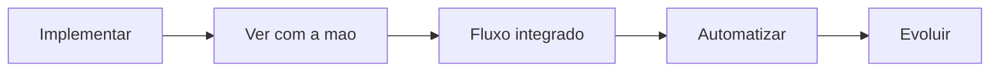

# Ciclo de estudo

```mermaid
flowchart LR
  I[Implementar] --> V[Ver com a mao]
  V --> F[Fluxo integrado]
  F --> A[Automatizar]
  A --> E[Evoluir]
```

Leia da esquerda para a direita. Detalhe em [../ciclo-das-cinco-etapas.md](../ciclo-das-cinco-etapas.md).
