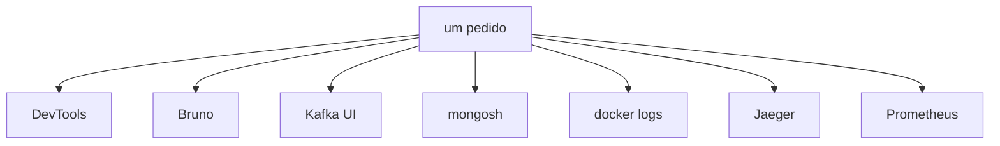

# O que cada ferramenta enxerga

```mermaid
flowchart TB
  Pedido[um pedido]
  Pedido --> Dev[DevTools]
  Pedido --> Bruno[Bruno]
  Pedido --> UI[Kafka UI]
  Pedido --> Mongo[mongosh]
  Pedido --> Log[docker logs]
  Pedido --> Jaeger[Jaeger]
  Pedido --> Prom[Prometheus]
```

Nenhuma caixa substitui as outras. A tabela está em [../ferramentas/README.md](../ferramentas/README.md).
