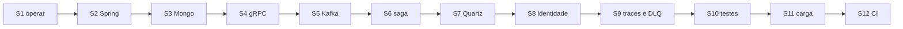

# Doze semanas

```mermaid
flowchart LR
  S1[S1 operar] --> S2[S2 Spring]
  S2 --> S3[S3 Mongo]
  S3 --> S4[S4 gRPC]
  S4 --> S5[S5 Kafka]
  S5 --> S6[S6 saga]
  S6 --> S7[S7 Quartz]
  S7 --> S8[S8 identidade]
  S8 --> S9[S9 traces e DLQ]
  S9 --> S10[S10 testes]
  S10 --> S11[S11 carga]
  S11 --> S12[S12 CI]
```

Leia da esquerda para a direita. Cada caixa é uma semana, não um resumo para pular as outras.
