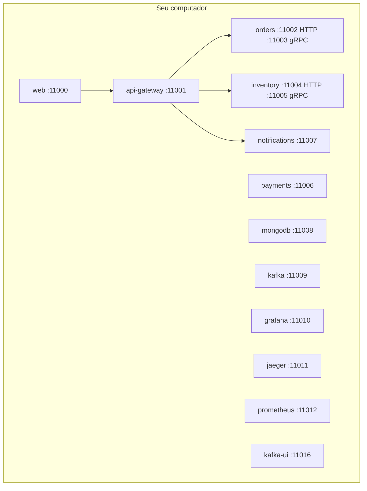

# Diagrama 1.1 — Stack e portas

## Onde você está

Leia da esquerda para a direita. Esta sessão está na **semana 01**. Foco: portas do host.

## Figura

A porta da esquerda na publicação Docker é a que você digita no browser. Kafka UI entra na semana 5; a porta 11016 já fica reservada.

## O que observar

Compare os nomes desta figura com os nomes reais do código e do Compose (`api-gateway`, `orders.events`, portas 11000+). Se um nome divergir, anote: ou o diagrama está velho, ou você está olhando outro ambiente.

## Exercício

Redesenhe esta figura sem olhar, em papel ou Mermaid. Depois abra de novo e marque o que esqueceu.

## Próximo arquivo

[diagrama-02-health.md](diagrama-02-health.md)
