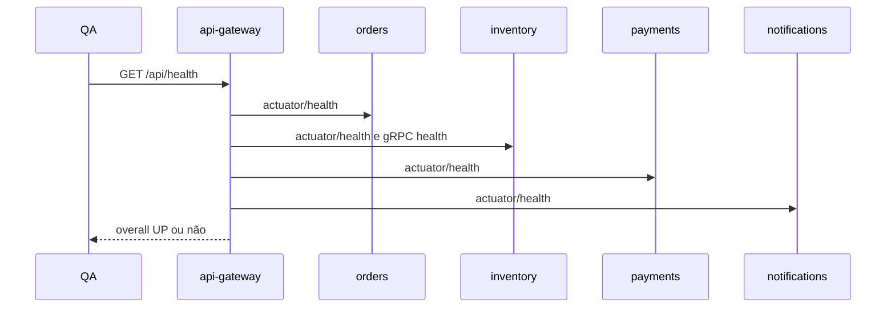

# Diagrama 1.2 — Health agregado

## Onde você está

Leia da esquerda para a direita. Esta sessão está na **semana 01**. Foco: quem o gateway consulta.

## Figura

Uma seta falha e o overall deixa de ser UP. Anote qual seta quebrou quando isso acontecer.

## O que observar

Compare os nomes desta figura com os nomes reais do código e do Compose (`api-gateway`, `orders.events`, portas 11000+). Se um nome divergir, anote: ou o diagrama está velho, ou você está olhando outro ambiente.

## Exercício

Redesenhe esta figura sem olhar, em papel ou Mermaid. Depois abra de novo e marque o que esqueceu.

## Próximo arquivo

Semana 2.
