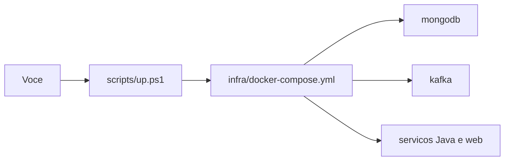

# Lab 1.1 — Subir a stack e ler o status

Tempo previsto: **80 min**. Semana 1. Pré-requisito: metas 1.1 a 1.3.

## Onde você está


Leia da esquerda para a direita. Esta sessão está na **semana 01**. Foco: Compose no ar.


## Figura desta sessão



Leia a figura antes do texto. O texto só nomeia o que a figura já mostrou.

## Objetivo

Subir o laboratório e saber se cada container está de pé antes de testar regra de negócio.

## 1. Implementar

1. Não escreva código nesta sessão. O 'implementar' aqui é operar o ambiente que já existe.
2. Leia o início de `scripts/up.ps1` e veja que ele entra em `infra` e chama `docker compose up -d --build`.

## 2. Ver manualmente

1. No PowerShell, na raiz do repo: `.\scripts\up.ps1`.
2. Espere o comando terminar. Depois: `cd infra; docker compose ps`.
3. Anote containers que não estão `running` ou `healthy`.

## 3. Validar o fluxo integrado

1. Confira se `api-gateway` publica 11001 e `web` publica 11000.
2. Abra dois logs: `docker compose logs --tail=30 api-gateway` e `orders-service`.
3. Procure a linha de Tomcat/Netty dizendo que a porta subiu. Se não achar, o processo ainda não escutou.

## 4. Automatizar

1. O atalho já existe: `scripts/up.ps1` e `scripts/up.sh`.
2. Nesta semana você não cria teste novo. Você anota o comando que vai repetir amanhã.

## 5. Evoluir

1. Se um serviço falhar sempre no mesmo ponto, copie as últimas 40 linhas do log para o seu relatório.
2. Não 'otimize' o Compose ainda. Primeiro ele precisa subir igual para todo mundo.

## Comandos — Windows (PowerShell)

```powershell
cd E:\projetos\SuperSolucaoModernaParaEstudos
.\scripts\up.ps1
cd infra
docker compose ps
```

## Comandos — Linux / WSL

```bash
cd /mnt/e/projetos/SuperSolucaoModernaParaEstudos
./scripts/up.sh
cd infra
docker compose ps
```

## Erros comuns

- Docker Desktop parado.
- Porta 11001 ocupada por outro projeto.
- Build Maven falhou e a imagem não foi criada.

## Pistas (leia só se travar)

- `docker compose logs --tail=80 <nome-do-servico>`
- No Windows, `netstat -ano | findstr 11001` mostra quem segurou a porta.

A solução comentada não fica neste arquivo. Se precisar de gabarito, olhe o comportamento do oráculo (este repositório) e a fonte oficial. Não copie um serviço inteiro.

## Perguntas

- Qual container precisa estar healthy antes do orders-service, segundo o Compose?

## Entregável

Print ou texto de `docker compose ps` no relatório da semana.

## Rubrica

Aprovado se todos os serviços do Compose estão running/healthy e você nomeia um log que leu.

## Próximo arquivo

[lab-02-health-web-e-api.md](lab-02-health-web-e-api.md)
