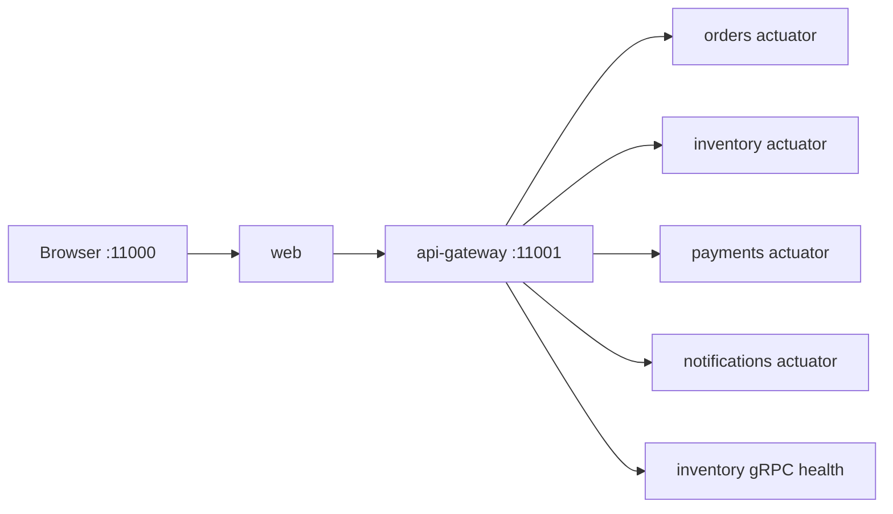

# Lab 1.2 — Health na web e na API

Tempo previsto: **70 min**. Semana 1. Pré-requisito: lab 1.1.

## Onde você está


Leia da esquerda para a direita. Esta sessão está na **semana 01**. Foco: health UP.


## Figura desta sessão



Leia a figura antes do texto. O texto só nomeia o que a figura já mostrou.

## Objetivo

Provar que o health agregado está UP pela tela e pelo HTTP, sem token.

## 1. Implementar

1. Nada de código. Você executa o que o gateway já faz em `HealthController`.

## 2. Ver manualmente

1. Abra http://localhost:11000/health e clique em atualizar.
2. No PowerShell: `curl.exe -s http://localhost:11001/api/health`.
3. Confira os nomes: api-gateway, orders-service, inventory-service, payments-service, notifications-service, inventory-grpc.

## 3. Validar o fluxo integrado

1. Se um serviço está DOWN, abra o log dele antes de reiniciar tudo.
2. Health público não pede `Authorization`. Se você recebeu 401, a URL não é `/api/health`.

## 4. Automatizar

1. O smoke já cobre este passo: `.\scripts\smoke.ps1` (ele também faz login; se falhar no health, pare aqui).
2. Guarde o JSON do health no relatório.

## 5. Evoluir

1. Anote quanto tempo o health levou para ficar UP depois do `up`. Esse número vira timeout de CI mais tarde.

## Comandos — Windows (PowerShell)

```powershell
curl.exe -s http://localhost:11001/api/health
```

## Comandos — Linux / WSL

```bash
curl -s http://localhost:11001/api/health | jq
```

## Erros comuns

- Testar `/health` no gateway em vez de `/api/health`.
- Achar que a página web na porta 11001 existe. A web é 11000.

## Pistas (leia só se travar)

- Swagger também existe: http://localhost:11001/swagger-ui.html

A solução comentada não fica neste arquivo. Se precisar de gabarito, olhe o comportamento do oráculo (este repositório) e a fonte oficial. Não copie um serviço inteiro.

## Perguntas

- Por que `inventory-grpc` aparece separado de `inventory-service`?

## Entregável

JSON do health com `overall` UP colado no relatório.

## Rubrica

Aprovado se os seis nomes esperados estão UP.

## Próximo arquivo

[lab-03-devtools.md](lab-03-devtools.md)
