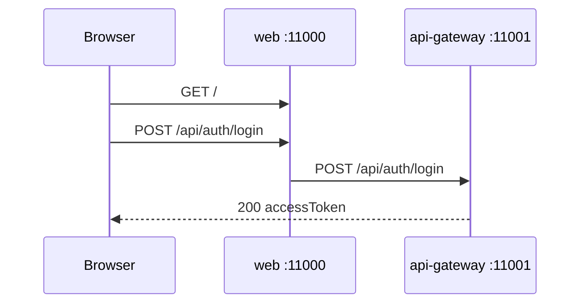

# Lab 1.3 — Seguir o login no DevTools

Tempo previsto: **75 min**. Semana 1. Pré-requisito: meta 1.5.

## Onde você está


Leia da esquerda para a direita. Esta sessão está na **semana 01**. Foco: Network do login.


## Figura desta sessão



Leia a figura antes do texto. O texto só nomeia o que a figura já mostrou.

## Objetivo

Ver com os próprios olhos o login e o token nas chamadas seguintes.

## 1. Implementar

1. Não altere o frontend. Observe.

## 2. Ver manualmente

1. F12, Network, Preserve log, limpe a lista.
2. Login `qa` / `qa123`.
3. Abra o POST de login. Status 200. Veja que a resposta tem `accessToken` e `roles`.
4. Abra Application, Local Storage, e ache a chave do token (não publique o valor).

## 3. Validar o fluxo integrado

1. Navegue ao catálogo. A chamada `/api/products` deve ir com Bearer.
2. Se a chamada de produtos foi para `localhost:11000/api/...`, o proxy da web encaminhou ao gateway. Isso é esperado.

## 4. Automatizar

1. Anote método, caminho e status. Isso vira o primeiro teste Playwright na semana 10.
2. Ainda não escreva o teste.

## 5. Evoluir

1. Saia (`btn-logout`) e entre como `admin`. Veja se o menu Estoque aparece (`nav-admin-stock`).

## Comandos — Windows (PowerShell)

```powershell
# navegador
# http://localhost:11000/login
```

## Comandos — Linux / WSL

```bash
# navegador
# http://localhost:11000/login
```

## Erros comuns

- Olhar a chamada e não rolar até Request Headers.
- Achar 401 em produtos porque o login foi na UI errada (OIDC vs local).

## Pistas (leia só se travar)

- Se o botão diz Keycloak, a stack subiu no modo OIDC. Volte ao Compose padrão ou siga o tutorial 02 mais tarde.

A solução comentada não fica neste arquivo. Se precisar de gabarito, olhe o comportamento do oráculo (este repositório) e a fonte oficial. Não copie um serviço inteiro.

## Perguntas

- O token prova o usuário ou o serviço?

## Entregável

Três linhas: status do login, se produtos levou Bearer, se admin vê o menu Estoque.

## Rubrica

Aprovado se as três linhas estão corretas.

## Próximo arquivo

[lab-04-desenhar-o-caminho.md](lab-04-desenhar-o-caminho.md)
