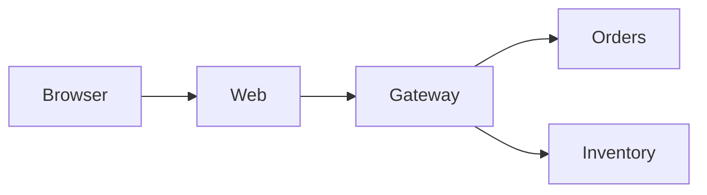

# Lab 1.4 — Desenhar o caminho da web até o gateway

Tempo previsto: **70 min**. Semana 1. Pré-requisito: labs anteriores da semana.

## Onde você está


Leia da esquerda para a direita. Esta sessão está na **semana 01**. Foco: mapa que você mesmo desenha.


## Figura desta sessão



Leia a figura antes do texto. O texto só nomeia o que a figura já mostrou.

## Objetivo

Fechar a semana desenhando o caminho sem copiar o diagrama pronto.

## 1. Implementar

1. Abra um editor de texto vazio. Não abra `docs/arquitetura.md` nos primeiros 15 minutos.

## 2. Ver manualmente

1. Liste o que você clicou hoje e a URL que apareceu.
2. Desenhe caixas: browser, web, gateway. Ligue com setas e escreva a porta.

## 3. Validar o fluxo integrado

1. Agora abra o diagrama da arquitetura e marque em vermelho o que você esqueceu (Kafka, Mongo, observabilidade).
2. Não se cobre de Kafka ainda. Só registre que ele existe e que não foi usado nesta semana.

## 4. Automatizar

1. Salve o desenho em Mermaid no seu relatório. Um bloco de 8 linhas basta.

## 5. Evoluir

1. Acrescente uma nota: o que você testaria amanhã se o health estivesse DOWN.

## Comandos — Windows (PowerShell)

```powershell
# sem comando obrigatorio
# opcional: Start-Process http://localhost:11000
```

## Comandos — Linux / WSL

```bash
# sem comando obrigatorio
```

## Erros comuns

- Desenhar tudo que você leu, sem ter visto. O desenho desta semana é só o que você operou.

## Pistas (leia só se travar)

- Modelo mínimo: Browser -->|HTTP| web:11000 --> gateway:11001

A solução comentada não fica neste arquivo. Se precisar de gabarito, olhe o comportamento do oráculo (este repositório) e a fonte oficial. Não copie um serviço inteiro.

## Perguntas

- Qual caixa você não consegue explicar ainda?

## Entregável

Um Mermaid seu no relatório da semana 1.

## Rubrica

Aprovado se o desenho tem portas e você lista uma dúvida honesta.

## Próximo arquivo

[leitura-01-http-e-compose.md](leitura-01-http-e-compose.md)
