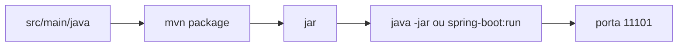

# Diagrama 2.1 — Do código ao processo

## Onde você está

Leia da esquerda para a direita. Esta sessão está na **semana 02**. Foco: build.

## Figura

Se o curl falha com connection refused, o processo não está na porta. Se falha com 404, o processo está no ar e a rota não existe.

## O que observar

Compare os nomes desta figura com os nomes reais do código e do Compose (`api-gateway`, `orders.events`, portas 11000+). Se um nome divergir, anote: ou o diagrama está velho, ou você está olhando outro ambiente.

## Exercício

Redesenhe esta figura sem olhar, em papel ou Mermaid. Depois abra de novo e marque o que esqueceu.

## Próximo arquivo

[diagrama-02-antes-depois.md](diagrama-02-antes-depois.md)
