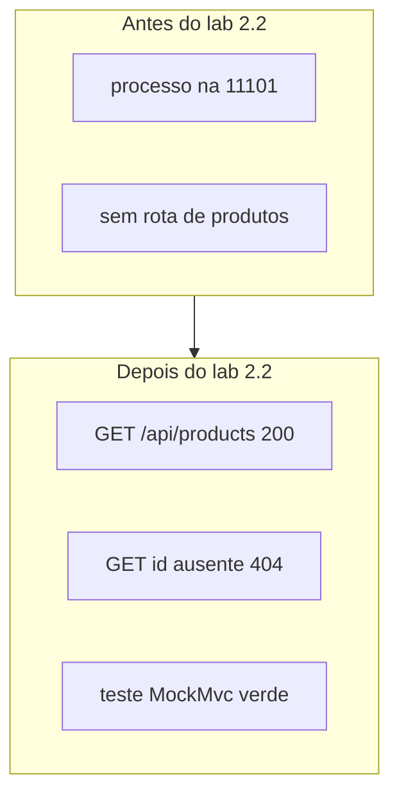

# Diagrama 2.2 — Espelho vazio e com catálogo

## Onde você está

Leia da esquerda para a direita. Esta sessão está na **semana 02**. Foco: checkpoint catalog-api.

## Figura

Este é o primeiro antes/depois do projeto espelho. Os próximos checkpoints seguem o mesmo desenho.

## O que observar

Compare os nomes desta figura com os nomes reais do código e do Compose (`api-gateway`, `orders.events`, portas 11000+). Se um nome divergir, anote: ou o diagrama está velho, ou você está olhando outro ambiente.

## Exercício

Redesenhe esta figura sem olhar, em papel ou Mermaid. Depois abra de novo e marque o que esqueceu.

## Próximo arquivo

Semana 3.
