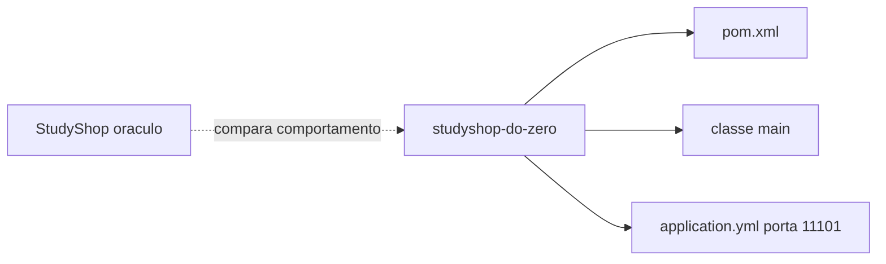

# Lab 2.1 — Criar o projeto espelho vazio

Tempo previsto: **90 min**. Semana 2. Pré-requisito: metas 2.1 e 2.2.

## Onde você está


Leia da esquerda para a direita. Esta sessão está na **semana 02**. Foco: pasta irmã studyshop-do-zero.


## Figura desta sessão



Leia a figura antes do texto. O texto só nomeia o que a figura já mostrou.

## Objetivo

Ter um Spring Boot que sobe sozinho, numa porta que não briga com o oráculo (11101).

## 1. Implementar

1. Crie a pasta `../studyshop-do-zero` ao lado deste repo, não dentro dele.
2. Use https://start.spring.io com Maven, Java 21, dependências Spring Web e Validation.
3. Em `application.yml`, `server.port: 11101`.
4. Rode `mvn spring-boot:run` e pare com Ctrl+C depois de ver a porta.

## 2. Ver manualmente

1. `curl.exe -i http://localhost:11101/api/products` pode dar 404. Isso é sucesso desta sessão: o processo escuta e ainda não tem rota.
2. Confirme que o oráculo na 11001 continua no ar, se você o deixou ligado.

## 3. Validar o fluxo integrado

1. Anote no README do espelho: porta, comando de subir, e a frase 'ainda não há catálogo'.
2. Não copie controllers do oráculo.

## 4. Automatizar

1. Ainda não há teste. O critério automático desta sessão é o processo subir.
2. O validador `bootstrap` em `scripts/academy` olha se existem `pom.xml` e `src/main/java`.

## 5. Evoluir

1. Escolha um nome de pacote estável, por exemplo `com.studyshop.catalog`. Mudar depois quebra import.

## Comandos — Windows (PowerShell)

```powershell
cd ..\studyshop-do-zero
mvn spring-boot:run
```

## Comandos — Linux / WSL

```bash
cd ../studyshop-do-zero
mvn spring-boot:run
```

## Erros comuns

- Criar o projeto dentro do oráculo e misturar os poms.
- Usar a porta 11001 e derrubar o gateway sem perceber.

## Pistas (leia só se travar)

- start.spring.io já gera a classe main. Não escreva o main na mão na primeira vez.

A solução comentada não fica neste arquivo. Se precisar de gabarito, olhe o comportamento do oráculo (este repositório) e a fonte oficial. Não copie um serviço inteiro.

## Perguntas

- Por que a porta do espelho não é 11001?

## Entregável

README do espelho com o comando e a porta. Saída do validador bootstrap.

## Rubrica

Aprovado se a aplicação sobe na 11101 e o oráculo, se estiver ligado, continua na 11001.

## Próximo arquivo

[lab-02-endpoint-catalogo.md](lab-02-endpoint-catalogo.md)
