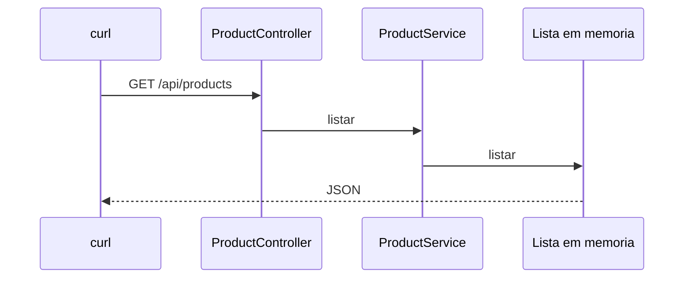

# Lab 2.2 — API de catálogo em memória

Tempo previsto: **90 min**. Semana 2. Pré-requisito: lab 2.1.

## Onde você está


Leia da esquerda para a direita. Esta sessão está na **semana 02**. Foco: GET e GET por id.


## Figura desta sessão



Leia a figura antes do texto. O texto só nomeia o que a figura já mostrou.

## Objetivo

Devolver pelo menos dois produtos fixos e 404 para id desconhecido.

## 1. Implementar

1. Crie os três tipos: controller, service, repositório em memória com dois produtos (`p-1`, `p-2`).
2. GET `/api/products` e GET `/api/products/{id}`.
3. Id ausente: 404 com JSON `message`.

## 2. Ver manualmente

1. Suba o espelho. `curl.exe http://localhost:11101/api/products`.
2. Chame um id que existe e um que não existe.
3. Anote os três status.

## 3. Validar o fluxo integrado

1. Reinicie o processo e chame de novo. A lista volta igual, porque está no código, não no disco. Escreva isso no relatório: ainda não há persistência.
2. Não envolva o gateway do oráculo. Este lab é o processo novo sozinho.

## 4. Automatizar

1. Escreva um teste MockMvc: lista 200 e id `nao-existe` 404.
2. `mvn test` verde.

## 5. Evoluir

1. Acrescente validação: se você criar POST depois, quantidade negativa é 400. Se não houver POST, documente que o catálogo é só leitura nesta semana.

## Comandos — Windows (PowerShell)

```powershell
curl.exe -i http://localhost:11101/api/products
curl.exe -i http://localhost:11101/api/products/nao-existe
```

## Comandos — Linux / WSL

```bash
curl -i http://localhost:11101/api/products
curl -i http://localhost:11101/api/products/nao-existe
```

## Erros comuns

- 404 do Spring em HTML porque faltou tratar a exceção. Force um `@ControllerAdvice` ou `ResponseStatusException`.
- Esquecer `@RestController` e receber corpo vazio.

## Pistas (leia só se travar)

- `ResponseStatusException(HttpStatus.NOT_FOUND, "produto nao encontrado")` resolve o 404 sem framework extra.

A solução comentada não fica neste arquivo. Se precisar de gabarito, olhe o comportamento do oráculo (este repositório) e a fonte oficial. Não copie um serviço inteiro.

## Perguntas

- O que se perde quando você reinicia o processo?

## Entregável

Teste verde e os três curls anotados.

## Rubrica

Aprovado se 200, 200 por id e 404 estão vistos à mão e no JUnit.

## Próximo arquivo

[lab-03-ver-no-swagger.md](lab-03-ver-no-swagger.md)
