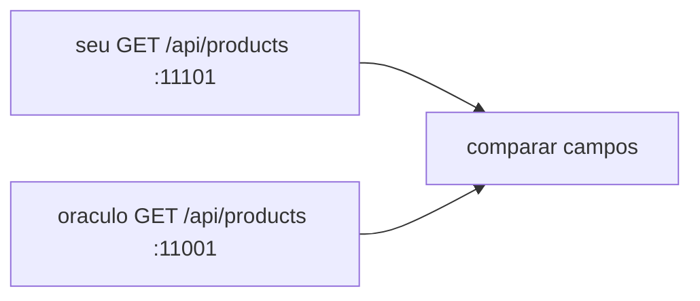

# Lab 2.3 — Ver o contrato no Swagger do oráculo

Tempo previsto: **60 min**. Semana 2. Pré-requisito: lab 2.2.

## Onde você está


Leia da esquerda para a direita. Esta sessão está na **semana 02**. Foco: comparar o seu contrato com o oráculo.


## Figura desta sessão



Leia a figura antes do texto. O texto só nomeia o que a figura já mostrou.

## Objetivo

Entender o que o catálogo do oráculo devolve a mais que o seu.

## 1. Implementar

1. Não copie o DTO. Liste diferenças.

## 2. Ver manualmente

1. Abra http://localhost:11001/swagger-ui.html no oráculo.
2. Faça login no Swagger (Authorize com Bearer) ou use o curl autenticado da semana 8 se o Swagger pedir token.
3. Anote campos de produto: id, nome, preço, estoque. Compare com os seus.

## 3. Validar o fluxo integrado

1. Escreva uma tabela: campo no oráculo, campo no espelho, igual ou ausente.
2. Se o seu nomeou `id` e o oráculo `productId`, isso é decisão. Documente. O validador de comportamento aceita os dois se você declarar o mapa no README.

## 4. Automatizar

1. O teste do espelho continua valendo para o seu contrato. Não quebre o teste para imitar nome de campo sem atualizar o assert.

## 5. Evoluir

1. Decida se vai alinhar os nomes agora ou na semana 4. Escreva a decisão.

## Comandos — Windows (PowerShell)

```powershell
curl.exe -s http://localhost:11001/api/health
```

## Comandos — Linux / WSL

```bash
curl -s http://localhost:11001/api/health
```

## Erros comuns

- Chamar `/api/products` do oráculo sem token e achar que a API está quebrada. Ela exige login. Health não exige.

## Pistas (leia só se travar)

- O tutorial `docs/tutoriais/01-jwt-local.md` mostra o login. Você aprofunda isso na semana 8; hoje basta um token para olhar o JSON.

A solução comentada não fica neste arquivo. Se precisar de gabarito, olhe o comportamento do oráculo (este repositório) e a fonte oficial. Não copie um serviço inteiro.

## Perguntas

- Qual campo seu está com outro nome?

## Entregável

Tabela de campos no relatório.

## Rubrica

Aprovado se a tabela existe e o teste do espelho segue verde.

## Próximo arquivo

[leitura-01-spring.md](leitura-01-spring.md)
