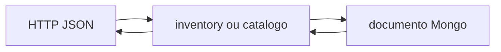

# Diagrama 3.1 — API, serviço e documento

## Onde você está

Leia da esquerda para a direita. Esta sessão está na **semana 03**. Foco: write path do catálogo.

## Figura

O formato do documento pode ter campos a mais (`_id`). O JSON público é uma escolha do controller.

## O que observar

Compare os nomes desta figura com os nomes reais do código e do Compose (`api-gateway`, `orders.events`, portas 11000+). Se um nome divergir, anote: ou o diagrama está velho, ou você está olhando outro ambiente.

## Exercício

Redesenhe esta figura sem olhar, em papel ou Mermaid. Depois abra de novo e marque o que esqueceu.

## Próximo arquivo

[diagrama-02-isolamento.md](diagrama-02-isolamento.md)
