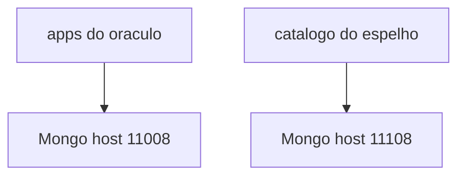

# Diagrama 3.2 — Dois Mongos

## Onde você está

Leia da esquerda para a direita. Esta sessão está na **semana 03**. Foco: não misturar oráculo e espelho.

## Figura

Seta cruzada é bug de configuração. Se o espelho gravar no 11008, você contaminou o lab.

## O que observar

Compare os nomes desta figura com os nomes reais do código e do Compose (`api-gateway`, `orders.events`, portas 11000+). Se um nome divergir, anote: ou o diagrama está velho, ou você está olhando outro ambiente.

## Exercício

Redesenhe esta figura sem olhar, em papel ou Mermaid. Depois abra de novo e marque o que esqueceu.

## Próximo arquivo

Semana 4.
