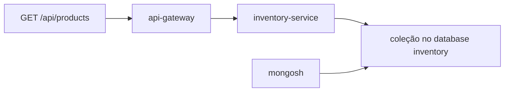

# Lab 3.1 — Inspecionar o Mongo do oráculo

Tempo previsto: **80 min**. Semana 3. Pré-requisito: meta 3.1.

## Onde você está


Leia da esquerda para a direita. Esta sessão está na **semana 03**. Foco: mongosh.


## Figura desta sessão



Leia a figura antes do texto. O texto só nomeia o que a figura já mostrou.

## Objetivo

Ver o mesmo produto pela API e pelo banco.

## 1. Implementar

1. Não altere documentos nesta sessão. Só leitura.

## 2. Ver manualmente

1. `cd infra` e `docker compose exec mongodb mongosh --eval "show dbs"`.
2. `docker compose exec mongodb mongosh inventory --eval "show collections"`.
3. Faça `find` limitado a 5 e copie um documento para o relatório (sem senha; não há senha neste lab).

## 3. Validar o fluxo integrado

1. Faça login na API e `GET /api/products`.
2. Confira se o id e a quantidade batem com o documento.
3. Se a quantidade divergir, você está olhando outra coleção ou outro ambiente.

## 4. Automatizar

1. Anote o comando mongosh no seu caderno. Ele volta na semana 6 para ver o pedido.
2. Não automatize mongosh ainda.

## 5. Evoluir

1. Escreva o que um QA não deve fazer: update manual para 'fazer o teste passar' sem registrar.

## Comandos — Windows (PowerShell)

```powershell
cd infra
docker compose exec mongodb mongosh inventory --eval "show collections"
```

## Comandos — Linux / WSL

```bash
cd infra
docker compose exec mongodb mongosh inventory --eval 'show collections'
```

## Erros comuns

- PowerShell come as aspas. Use aspas simples no bash e aspas escapadas no PowerShell, como no exemplo.
- Conectar em `localhost:27017` em vez de `11008` a partir do host.

## Pistas (leia só se travar)

- Do host, se tiver mongosh instalado: `mongosh mongodb://localhost:11008/inventory`.

A solução comentada não fica neste arquivo. Se precisar de gabarito, olhe o comportamento do oráculo (este repositório) e a fonte oficial. Não copie um serviço inteiro.

## Perguntas

- A API e o documento precisam ter a mesma quantidade. Se não tiverem, qual dos dois você acredita primeiro e por quê?

## Entregável

Um documento colado e o JSON correspondente da API.

## Rubrica

Aprovado se os dois lados mostram o mesmo id e a mesma quantidade.

## Próximo arquivo

[lab-02-persistir-no-espello.md](lab-02-persistir-no-espello.md)
