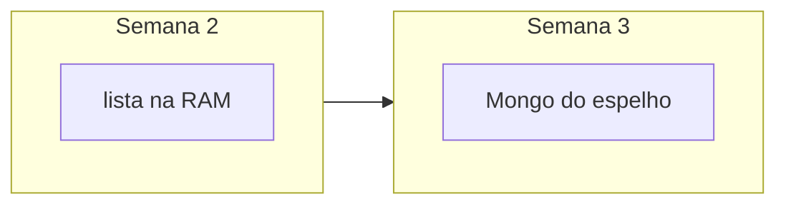

# Lab 3.2 — Trocar a lista em memória por Mongo

Tempo previsto: **90 min**. Semana 3. Pré-requisito: lab 2.2 e meta 3.1.

## Onde você está


Leia da esquerda para a direita. Esta sessão está na **semana 03**. Foco: persistência no projeto espelho.


## Figura desta sessão



Leia a figura antes do texto. O texto só nomeia o que a figura já mostrou.

## Objetivo

Reiniciar o processo do espelho e ainda ver os produtos.

## 1. Implementar

1. Suba um Mongo só do espelho na porta 11108 para não usar o volume do oráculo: `docker run --name espelho-mongo -p 11108:27017 -d mongo:7`.
2. Adicione Spring Data MongoDB no `pom.xml` e a URI `mongodb://localhost:11108/catalog`.
3. Grave dois produtos na subida se a coleção estiver vazia.
4. GET continua igual para o cliente.

## 2. Ver manualmente

1. Crie ou liste. Pare o Java. Suba de novo. GET de novo. Os produtos continuam.
2. Abra `mongosh mongodb://localhost:11108/catalog` e dê `find`.

## 3. Validar o fluxo integrado

1. O teste de API e o documento contam a mesma quantidade de itens.
2. Não aponte o espelho para `localhost:11008`. Esse é o oráculo.

## 4. Automatizar

1. Atualize o teste: ou sobe com Testcontainers, ou usa um perfil que limpa a coleção. Se Testcontainers for pesado demais nesta semana, documente um `@BeforeEach` que apaga a coleção num Mongo local de teste.
2. `mvn test` verde.

## 5. Evoluir

1. Anote o tempo de subida. Se passar de um minuto, você vai sentir isso no CI.

## Comandos — Windows (PowerShell)

```powershell
docker run --name espelho-mongo -p 11108:27017 -d mongo:7
curl.exe -s http://localhost:11101/api/products
```

## Comandos — Linux / WSL

```bash
docker run --name espelho-mongo -p 11108:27017 -d mongo:7
curl -s http://localhost:11101/api/products
```

## Erros comuns

- URI sem nome do database.
- Esquecer de parar o container e achar que os dados sumiram por bug da API.

## Pistas (leia só se travar)

- `spring.data.mongodb.uri` no YAML do espelho.

A solução comentada não fica neste arquivo. Se precisar de gabarito, olhe o comportamento do oráculo (este repositório) e a fonte oficial. Não copie um serviço inteiro.

## Perguntas

- O que mudou no JSON público em relação à semana 2?

## Entregável

Print do find depois de reiniciar o Java.

## Rubrica

Aprovado se o dado sobrevive ao restart e o teste verde não depende do Mongo do oráculo.

## Próximo arquivo

[lab-03-teste-com-mongo.md](lab-03-teste-com-mongo.md)
