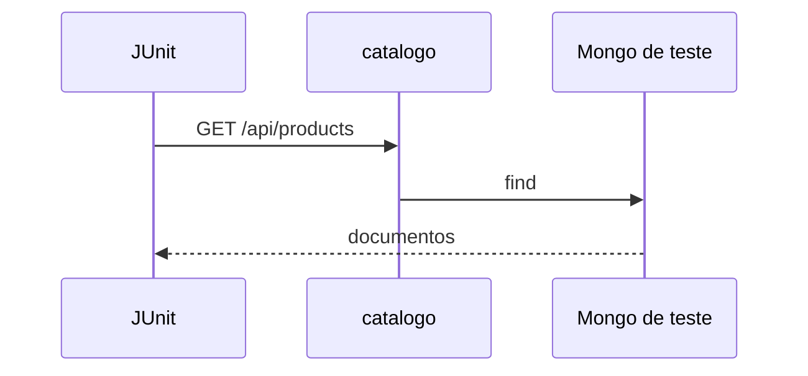

# Lab 3.3 — Teste de integração do catálogo

Tempo previsto: **80 min**. Semana 3. Pré-requisito: lab 3.2.

## Onde você está


Leia da esquerda para a direita. Esta sessão está na **semana 03**. Foco: teste que olha API e efeito no banco.


## Figura desta sessão



Leia a figura antes do texto. O texto só nomeia o que a figura já mostrou.

## Objetivo

Um teste que falha se o repositório não grava.

## 1. Implementar

1. Escreva o teste que sobe o contexto Spring e chama GET.
2. Se a lista vier vazia, o seed do teste não rodou: falhe com mensagem clara.

## 2. Ver manualmente

1. Rode `mvn test` e leia o relatório surefire se falhar.
2. Rode o mesmo GET com curl contra o processo manual, para não confundir porta de teste com porta 11101.

## 3. Validar o fluxo integrado

1. O teste não pode usar a porta 11008.
2. Depois do teste, a coleção de teste está limpa ou o database de teste é outro.

## 4. Automatizar

1. O comando único é `mvn test`. Coloque-o no README.

## 5. Evoluir

1. Se o teste ficar lento, meça. Não paralelize ainda.

## Comandos — Windows (PowerShell)

```powershell
mvn test
```

## Comandos — Linux / WSL

```bash
mvn test
```

## Erros comuns

- Teste verde porque leu a lista em memória antiga e você esqueceu de remover o repositório da semana 2.
- Dois beans de repositório e o Spring não sabe qual usar.

## Pistas (leia só se travar)

- Apague a implementação em memória ou marque uma delas com `@Profile`.

A solução comentada não fica neste arquivo. Se precisar de gabarito, olhe o comportamento do oráculo (este repositório) e a fonte oficial. Não copie um serviço inteiro.

## Perguntas

- O teste prova persistência ou só o JSON?

## Entregável

Saída de `mvn test` verde no relatório.

## Rubrica

Aprovado se o teste quebra quando você aponta para um Mongo vazio sem seed.

## Próximo arquivo

[leitura-01-mongodb.md](leitura-01-mongodb.md)
