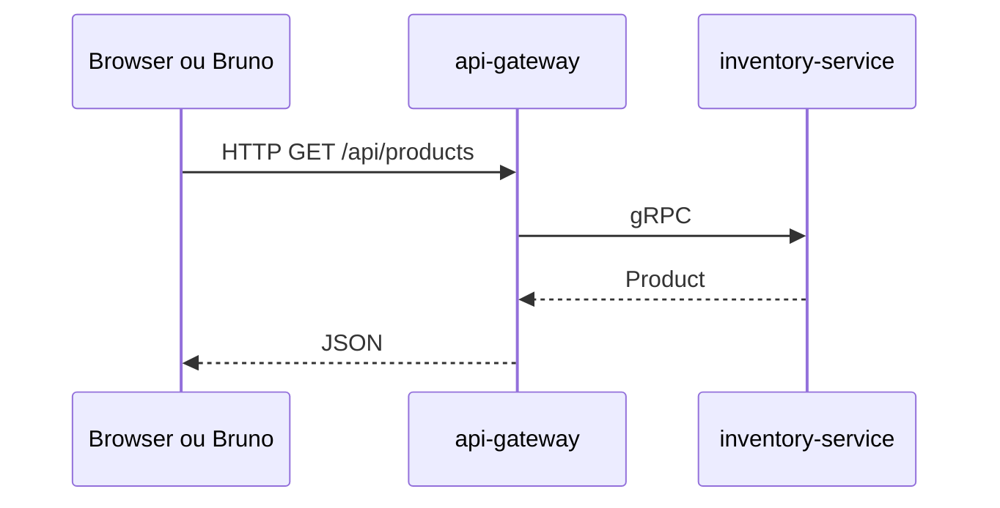

# Diagrama 4.1 — REST na borda, gRPC por dentro

## Onde você está

Leia da esquerda para a direita. Esta sessão está na **semana 04**. Foco: uma request de catálogo.

## Figura

Se o HTTP nem sai do browser, o problema é a web. Se o HTTP chega e o gRPC não, o problema é o endereço do stub.

## O que observar

Compare os nomes desta figura com os nomes reais do código e do Compose (`api-gateway`, `orders.events`, portas 11000+). Se um nome divergir, anote: ou o diagrama está velho, ou você está olhando outro ambiente.

## Exercício

Redesenhe esta figura sem olhar, em papel ou Mermaid. Depois abra de novo e marque o que esqueceu.

## Próximo arquivo

[diagrama-02-erros.md](diagrama-02-erros.md)
