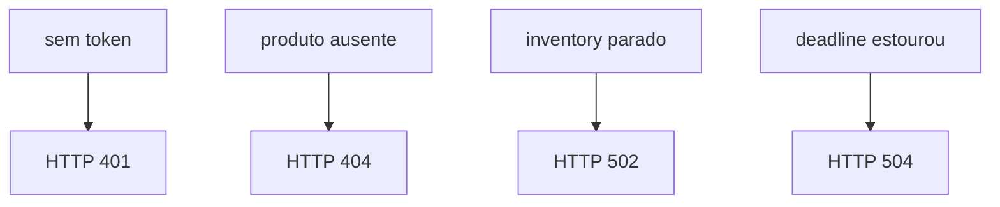

# Diagrama 4.2 — Onde o erro nasce

## Onde você está

Leia da esquerda para a direita. Esta sessão está na **semana 04**. Foco: mapa de falhas da chamada síncrona.

## Figura

Cada caixa da esquerda é uma causa diferente. Não as trate como 'deu erro'.

## O que observar

Compare os nomes desta figura com os nomes reais do código e do Compose (`api-gateway`, `orders.events`, portas 11000+). Se um nome divergir, anote: ou o diagrama está velho, ou você está olhando outro ambiente.

## Exercício

Redesenhe esta figura sem olhar, em papel ou Mermaid. Depois abra de novo e marque o que esqueceu.

## Próximo arquivo

Semana 5.
