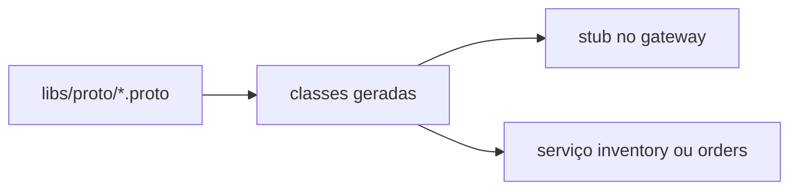

# Lab 4.1 — Ler o contrato e achar o método na chamada

Tempo previsto: **70 min**. Semana 4. Pré-requisito: metas 4.1 e 4.2.

## Onde você está


Leia da esquerda para a direita. Esta sessão está na **semana 04**. Foco: proto do oráculo.


## Figura desta sessão



Leia a figura antes do texto. O texto só nomeia o que a figura já mostrou.

## Objetivo

Ligar um campo do `.proto` a um campo do JSON público.

## 1. Implementar

1. Não altere o proto do oráculo nesta sessão.

## 2. Ver manualmente

1. Abra `inventory.proto`. Escolha um campo de produto.
2. Ache o mesmo conceito no JSON de `GET /api/products` (com token).
3. Escreva: nome no proto, nome no JSON, igual ou traduzido.

## 3. Validar o fluxo integrado

1. Se os nomes diferem, o lugar da tradução é o gateway ou o mapper. Procure no `ApiController` ou DTO.
2. Anote o arquivo.

## 4. Automatizar

1. Não gere teste ainda. A evidência é a tabela de três colunas.

## 5. Evoluir

1. Se quiser, instale `grpcurl` depois. Não é obrigatório para passar.

## Comandos — Windows (PowerShell)

```powershell
cd infra
docker compose ps inventory-service
```

## Comandos — Linux / WSL

```bash
cd infra && docker compose ps inventory-service
```

## Erros comuns

- Editar o proto 'para aprender' e quebrar o build do time.
- Comparar com a API sem token e anotar 401 como se fosse o formato do produto.

## Pistas (leia só se travar)

- Login está em `docs/tutoriais/01-jwt-local.md`.

A solução comentada não fica neste arquivo. Se precisar de gabarito, olhe o comportamento do oráculo (este repositório) e a fonte oficial. Não copie um serviço inteiro.

## Perguntas

- Quem traduz o nome do campo?

## Entregável

Tabela proto × JSON × arquivo de tradução.

## Rubrica

Aprovado se a tabela cita arquivo real do repositório.

## Próximo arquivo

[lab-02-separar-servicos.md](lab-02-separar-servicos.md)
