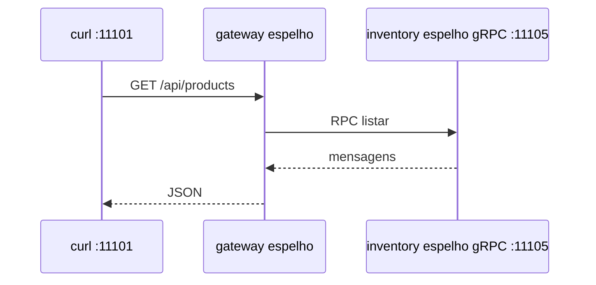

# Lab 4.2 — Dois processos no espelho

Tempo previsto: **100 min**. Semana 4. Pré-requisito: lab 3.2.

## Onde você está


Leia da esquerda para a direita. Esta sessão está na **semana 04**. Foco: catálogo gRPC e um gateway mínimo.


## Figura desta sessão



Leia a figura antes do texto. O texto só nomeia o que a figura já mostrou.

## Objetivo

O curl continua na porta do gateway. O catálogo deixa de ser o processo que você chamava direto, ou você documenta uma fase intermediária com os dois.

## 1. Implementar

1. Crie um segundo módulo ou segundo projeto `inventory` com gRPC na porta 11105.
2. Mova a leitura dos produtos para lá.
3. O processo da 11101 só encaminha.
4. Comece pelo guia oficial de gRPC Java. Não copie o módulo `libs/proto` inteiro; um proto com um método basta.

## 2. Ver manualmente

1. Suba os dois processos. Curl no gateway.
2. Pare só o inventory. Curl de novo. Anote 502 ou equivalente.
3. Suba o inventory. Curl volta a 200.

## 3. Validar o fluxo integrado

1. Log dos dois processos no momento do 200.
2. O Mongo do catálogo continua o da 11108, atrás do inventory, não atrás do gateway.

## 4. Automatizar

1. Teste de contrato: gateway devolve 200 quando o inventory está no ar. Pode ser teste manual scriptado em `scripts/check-catalog.sh` dentro do espelho.
2. Um assert automático que sobe os dois é ótimo; se não conseguir nesta semana, entregue o script e marque a dívida no README.

## 5. Evoluir

1. Acrescente deadline de 2 segundos no stub. Documente o que acontece se o inventory dorme.

## Comandos — Windows (PowerShell)

```powershell
# dois terminais no espelho
# inventory gRPC 11105
# gateway 11101
```

## Comandos — Linux / WSL

```bash
# dois terminais no espelho
```

## Erros comuns

- Gateway falar com `localhost:11005` (oráculo) em vez de `11105`.
- Esquecer de gerar as classes do proto e importar pacote que não existe.

## Pistas (leia só se travar)

- Plugin `protobuf-maven-plugin` no pom do módulo proto pequeno. O oráculo tem um exemplo em `libs/proto/pom.xml` — leia, não copie o arquivo inteiro.

A solução comentada não fica neste arquivo. Se precisar de gabarito, olhe o comportamento do oráculo (este repositório) e a fonte oficial. Não copie um serviço inteiro.

## Perguntas

- Com o inventory parado, o status é regra de negócio ou falha de rede?

## Entregável

Notas dos dois curls (no ar e parado) e o proto novo no espelho.

## Rubrica

Aprovado se o 200 depende do segundo processo e você provou isso parando-o.

## Próximo arquivo

[lab-03-contrato.md](lab-03-contrato.md)
