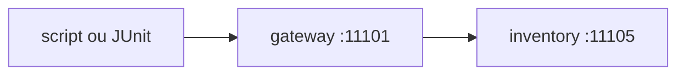

# Lab 4.3 — Automatizar o contrato mínimo

Tempo previsto: **70 min**. Semana 4. Pré-requisito: lab 4.2.

## Onde você está


Leia da esquerda para a direita. Esta sessão está na **semana 04**. Foco: teste repetível do gateway.


## Figura desta sessão



Leia a figura antes do texto. O texto só nomeia o que a figura já mostrou.

## Objetivo

Um comando só que falha se a lista não voltar.

## 1. Implementar

1. Escreva o teste ou o script que faz GET e exige status 200 e pelo menos um item.
2. Mensagem de falha deve dizer a porta e o corpo recebido.

## 2. Ver manualmente

1. Rode o comando duas vezes. O resultado é o mesmo.
2. Rode com o inventory parado e veja a falha falhar pelo motivo certo.

## 3. Validar o fluxo integrado

1. O comando não chama a porta 11001.
2. Documente a ordem de subir: Mongo, inventory, gateway, teste.

## 4. Automatizar

1. Coloque o comando no README do espelho como 'contrato do catálogo'.

## 5. Evoluir

1. Se o teste levar mais que 10 segundos sem Testcontainers, explique o porquê.

## Comandos — Windows (PowerShell)

```powershell
mvn test
```

## Comandos — Linux / WSL

```bash
mvn test
```

## Erros comuns

- Assert só no tamanho da lista e ignorar 500 com corpo HTML.
- Hardcode de porta sem documentar.

## Pistas (leia só se travar)

- Imprima `status` e os primeiros 200 caracteres do corpo quando falhar.

A solução comentada não fica neste arquivo. Se precisar de gabarito, olhe o comportamento do oráculo (este repositório) e a fonte oficial. Não copie um serviço inteiro.

## Perguntas

- O que este teste ainda não prova? (saga, auth, estoque)

## Entregável

Comando único no README e uma execução verde.

## Rubrica

Aprovado se a falha com inventory parado é óbvia na mensagem.

## Próximo arquivo

[leitura-01-grpc.md](leitura-01-grpc.md)
