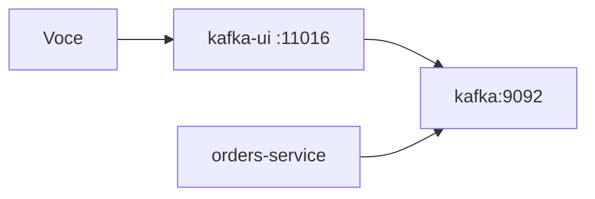

# Lab 5.1 — Ver tópicos na Kafka UI

Tempo previsto: **75 min**. Semana 5. Pré-requisito: meta 5.1.

## Onde você está


Leia da esquerda para a direita. Esta sessão está na **semana 05**. Foco: inspeção visual.


## Figura desta sessão



Leia a figura antes do texto. O texto só nomeia o que a figura já mostrou.

## Objetivo

Ver uma mensagem real sem usar só o log do Java.

## 1. Implementar

1. O serviço `kafka-ui` já está no Compose do oráculo. Se a UI não abrir, suba de novo com `scripts/up`.

## 2. Ver manualmente

1. Crie um pedido pela web (login qa, um mouse) ou pelo Bruno.
2. Abra http://localhost:11016.
3. Abra o tópico `orders.events` e ache `OrderCreated` com o seu `orderId`.

## 3. Validar o fluxo integrado

1. Ache o mesmo `orderId` em `inventory.events` (`StockReserved` ou `StockRejected`).
2. Se não aparecer em 30 segundos, olhe o lag do group `inventory-service` e o log do inventory.

## 4. Automatizar

1. Anote tópico, eventType e orderId. Isso vira assert na semana 10, não hoje.

## 5. Evoluir

1. Não apague tópico pela UI. Você quebraria o lab.

## Comandos — Windows (PowerShell)

```powershell
Start-Process http://localhost:11016
```

## Comandos — Linux / WSL

```bash
xdg-open http://localhost:11016 || true
```

## Erros comuns

- UI vazia porque o pedido não foi criado (401).
- Olhar o tópico errado e achar que 'não houve evento'.

## Pistas (leia só se travar)

- CLI equivalente está no lab seguinte, se a UI falhar.

A solução comentada não fica neste arquivo. Se precisar de gabarito, olhe o comportamento do oráculo (este repositório) e a fonte oficial. Não copie um serviço inteiro.

## Perguntas

- A mensagem continua no tópico depois do consumidor ler?

## Entregável

Print ou texto com tópico, offset e orderId.

## Rubrica

Aprovado se você correlaciona API e mensagem pelo mesmo orderId.

## Próximo arquivo

[lab-02-console-consumer.md](lab-02-console-consumer.md)
