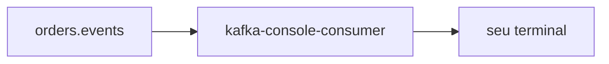

# Lab 5.2 — Ler o tópico pela CLI

Tempo previsto: **70 min**. Semana 5. Pré-requisito: lab 5.1.

## Onde você está


Leia da esquerda para a direita. Esta sessão está na **semana 05**. Foco: kafka-console-consumer.


## Figura desta sessão



Leia a figura antes do texto. O texto só nomeia o que a figura já mostrou.

## Objetivo

Não depender só da UI. O terminal mostra o JSON cru.

## 1. Implementar

1. Não publique lixo no tópico.

## 2. Ver manualmente

1. No `infra`: o comando de consumer do lab de ferramentas (`docs/academia-qa/ferramentas/kafka-cli.md`).
2. Deixe o consumer rodando, crie outro pedido, veja a linha aparecer.
3. Pare o consumer com Ctrl+C. Ele é um group à parte se você não fixar `--group`; não use o group `inventory-service`.

## 3. Validar o fluxo integrado

1. Confira que o lag do `inventory-service` não disparou por sua causa.
2. Se disparou, você usou o group errado. Anote o erro e não repita.

## 4. Automatizar

1. Salve um JSON de exemplo (sem dados pessoais; o e-mail do lab é fictício) no relatório.

## 5. Evoluir

1. Compare com a UI: os mesmos campos `eventType` e `orderId`.

## Comandos — Windows (PowerShell)

```powershell
cd infra
docker compose exec kafka /opt/kafka/bin/kafka-topics.sh --bootstrap-server localhost:9092 --list
```

## Comandos — Linux / WSL

```bash
cd infra
docker compose exec kafka /opt/kafka/bin/kafka-topics.sh --bootstrap-server localhost:9092 --list
```

## Erros comuns

- `--group inventory-service` rouba mensagem do serviço.
- Esquecer `--from-beginning` e achar que o tópico está vazio (você só vê o que chegar depois).

## Pistas (leia só se travar)

- Use `--group qa-lab-leitura` para não colidir.

A solução comentada não fica neste arquivo. Se precisar de gabarito, olhe o comportamento do oráculo (este repositório) e a fonte oficial. Não copie um serviço inteiro.

## Perguntas

- Por que o consumer de estudo precisa de outro group?

## Entregável

Uma linha JSON real no relatório.

## Rubrica

Aprovado se o group dos serviços não foi usado pelo seu consumer.

## Próximo arquivo

[lab-03-evento-no-espelho.md](lab-03-evento-no-espelho.md)
