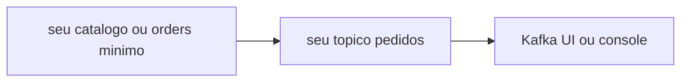

# Lab 5.3 — Publicar um evento no espelho

Tempo previsto: **90 min**. Semana 5. Pré-requisito: labs 5.1 e 5.2.

## Onde você está


Leia da esquerda para a direita. Esta sessão está na **semana 05**. Foco: primeiro produtor seu.


## Figura desta sessão



Leia a figura antes do texto. O texto só nomeia o que a figura já mostrou.

## Objetivo

Provar que o seu processo publica, antes de existir saga.

## 1. Implementar

1. Suba um Kafka do espelho na porta 11109 ou use um tópico prefixado `lab.` no Kafka do oráculo. Prefira o broker separado se você já sofreu com group errado.
2. Ao criar um produto ou um pedido mínimo, publique um JSON com `eventType` e id.
3. Não implemente consumidor ainda, ou implemente um que só loga.

## 2. Ver manualmente

1. Leia a mensagem na UI ou no console.
2. O id da API aparece na mensagem.

## 3. Validar o fluxo integrado

1. Reinicie o produtor. A mensagem antiga continua no tópico (log durável).
2. Escreva isso no relatório.

## 4. Automatizar

1. Um teste que sobe broker é opcional. Mínimo: script que falha se o curl não devolver o id que você depois acha no tópico. Pode ser manual nesta semana, com o passo escrito.

## 5. Evoluir

1. Meça o tempo entre o HTTP 200 e a mensagem aparecer. Anote.

## Comandos — Windows (PowerShell)

```powershell
# producer no espelho
# consumer de leitura com group proprio
```

## Comandos — Linux / WSL

```bash
# producer no espelho
```

## Erros comuns

- Publicar no tópico `orders.events` do oráculo e confundir a saga real.
- Esquecer a chave e achar que a ordem será sempre global.

## Pistas (leia só se travar)

- Tópico novo `lab.catalog.events` evita misturar com a saga.

A solução comentada não fica neste arquivo. Se precisar de gabarito, olhe o comportamento do oráculo (este repositório) e a fonte oficial. Não copie um serviço inteiro.

## Perguntas

- A mensagem some quando o consumidor lê?

## Entregável

Id da API igual ao id na mensagem.

## Rubrica

Aprovado se você mostra os dois lados.

## Próximo arquivo

[leitura-01-kafka.md](leitura-01-kafka.md)
