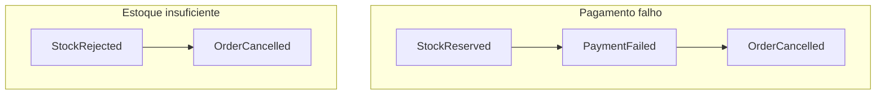

# Diagrama 6.2 — Duas falhas

## Onde você está

Leia da esquerda para a direita. Esta sessão está na **semana 06**. Foco: pagamento versus estoque.

## Figura

No primeiro, a reserva aconteceu. No segundo, não. O teste de estoque precisa dessa diferença.

## O que observar

Compare os nomes desta figura com os nomes reais do código e do Compose (`api-gateway`, `orders.events`, portas 11000+). Se um nome divergir, anote: ou o diagrama está velho, ou você está olhando outro ambiente.

## Exercício

Redesenhe esta figura sem olhar, em papel ou Mermaid. Depois abra de novo e marque o que esqueceu.

## Próximo arquivo

Semana 7.
