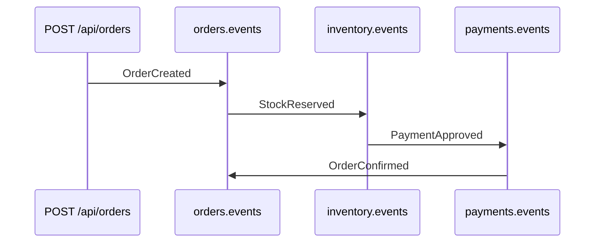

# Lab 6.1 — Pedido feliz de ponta a ponta

Tempo previsto: **80 min**. Semana 6. Pré-requisito: semana 5 e meta 6.1.

## Onde você está


Leia da esquerda para a direita. Esta sessão está na **semana 06**. Foco: CONFIRMED.


## Figura desta sessão



Leia a figura antes do texto. O texto só nomeia o que a figura já mostrou.

## Objetivo

Ver o estado final CONFIRMED e o estoque do mouse cair 1.

## 1. Implementar

1. Use o oráculo. Não implemente a saga no espelho neste lab (isso é o lab 6.3).

## 2. Ver manualmente

1. Anote o estoque de `prod-mouse`.
2. Crie o pedido pela UI ou API.
3. Faça polling até `CONFIRMED` ou até 60 segundos.
4. Anote o estoque de novo.

## 3. Validar o fluxo integrado

1. Ache `OrderCreated`, `StockReserved`, `PaymentApproved`, `OrderConfirmed` na UI do Kafka.
2. O mesmo orderId nos quatro.

## 4. Automatizar

1. Ainda não codifique o polling. Escreva o pseudocódigo: repetir GET, parar em CONFIRMED ou CANCELLED, falhar no timeout.

## 5. Evoluir

1. Se passou de 15 segundos, olhe o lag. Anote. Não otimize código do oráculo.

## Comandos — Windows (PowerShell)

```powershell
curl.exe -s http://localhost:11001/api/health
```

## Comandos — Linux / WSL

```bash
curl -s http://localhost:11001/api/health
```

## Erros comuns

- Não esperar e fotografar AWAITING_PAYMENT como resultado final.
- Usar produto sem estoque e achar que o feliz quebrou.

## Pistas (leia só se travar)

- A tela de detalhe já faz polling de 2s. Você pode só observar `order-status`.

A solução comentada não fica neste arquivo. Se precisar de gabarito, olhe o comportamento do oráculo (este repositório) e a fonte oficial. Não copie um serviço inteiro.

## Perguntas

- Quais eventos são obrigatórios no feliz?

## Entregável

orderId, status final, estoque antes e depois.

## Rubrica

Aprovado se CONFIRMED e estoque caiu 1.

## Próximo arquivo

[lab-02-falhas.md](lab-02-falhas.md)
