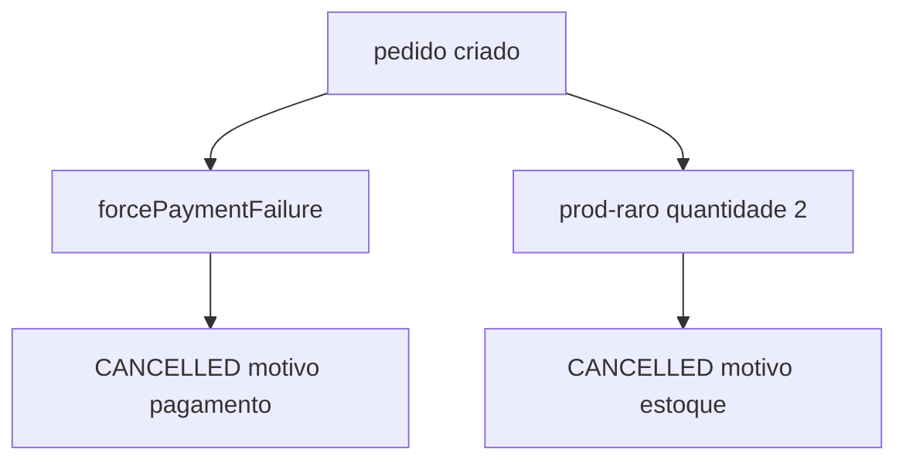

# Lab 6.2 — Pagamento e estoque

Tempo previsto: **80 min**. Semana 6. Pré-requisito: lab 6.1.

## Onde você está


Leia da esquerda para a direita. Esta sessão está na **semana 06**. Foco: dois CANCELLED diferentes.


## Figura desta sessão



Leia a figura antes do texto. O texto só nomeia o que a figura já mostrou.

## Objetivo

Distinguir dois cancelamentos pelo motivo e pelo efeito no estoque.

## 1. Implementar

1. Não altere Java do oráculo.

## 2. Ver manualmente

1. Pedido com `forcePaymentFailure` true. Espere CANCELLED. Anote estoque (não volta).
2. Pedido `prod-raro` quantidade 2. Espere CANCELLED. Anote estoque do raro (não deve cair, porque a reserva falha antes).
3. Se o raro já não tem estoque 1, peça ao admin para repor 1 antes.

## 3. Validar o fluxo integrado

1. No Kafka, o primeiro caminho tem `PaymentFailed`. O segundo tem `StockRejected` e não deve ter `PaymentApproved`.
2. Escreva isso.

## 4. Automatizar

1. Pseudocódigo de dois asserts. Implementação na semana 10.

## 5. Evoluir

1. Escreva o bug que você abriria se o raro decrementasse mesmo rejeitado. Esse sim seria defeito.

## Comandos — Windows (PowerShell)

```powershell
# ver docs/cenarios-qa.md cenarios 4 e 5
```

## Comandos — Linux / WSL

```bash
# ver docs/cenarios-qa.md
```

## Erros comuns

- Quantidade 2 no mouse (tem estoque) e achar que testou limite.
- Esquecer o Bearer e anotar 401 como CANCELLED.

## Pistas (leia só se travar)

- Motivo fica em `statusReason` no JSON e em `order-status-reason` na tela.

A solução comentada não fica neste arquivo. Se precisar de gabarito, olhe o comportamento do oráculo (este repositório) e a fonte oficial. Não copie um serviço inteiro.

## Perguntas

- Nos dois cancelamentos, o estoque se comporta igual?

## Entregável

Tabela com duas linhas: cenário, status, motivo, estoque antes, estoque depois, eventType decisivo.

## Rubrica

Aprovado se a tabela mostra comportamentos diferentes de estoque.

## Próximo arquivo

[lab-03-redesenhar.md](lab-03-redesenhar.md)
