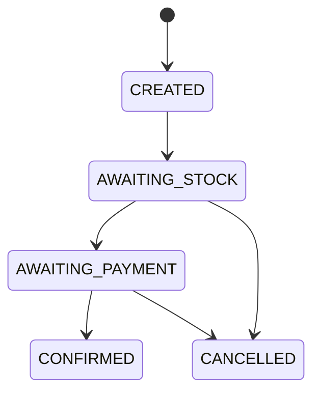

# Lab 6.3 — Redesenhar a saga e esboçar no espelho

Tempo previsto: **90 min**. Semana 6. Pré-requisito: lab 6.2.

## Onde você está


Leia da esquerda para a direita. Esta sessão está na **semana 06**. Foco: você desenha antes de olhar.


## Figura desta sessão



Leia a figura antes do texto. O texto só nomeia o que a figura já mostrou.

## Objetivo

Reconstruir o fluxo no papel e começar o esboço no espelho sem copiar as classes do oráculo.

## 1. Implementar

1. Feche `docs/status-pedido.md` por 20 minutos e desenhe.
2. Depois compare.
3. No espelho, crie os nomes dos tópicos e dos eventTypes no README. Código mínimo: publicar `OrderCreated` ao criar um pedido em memória ou Mongo. Consumidor pode só logar nesta sessão.

## 2. Ver manualmente

1. Compare seu desenho com o arquivo oficial e liste o que esqueceu.
2. Não apague o seu desenho. O esquecimento é o entregável.

## 3. Validar o fluxo integrado

1. O orderId do espelho aparece no log do consumidor.
2. Ainda não precisa de pagamento real.

## 4. Automatizar

1. Guarde o desenho no relatório. O teste automático da saga completa fica para quando os três serviços existirem. Não finja que já existe.

## 5. Evoluir

1. Liste o que falta para o checkpoint `saga`: estoque, pagamento, estados finais.

## Comandos — Windows (PowerShell)

```powershell
# desenho no relatorio
```

## Comandos — Linux / WSL

```bash
# desenho no relatorio
```

## Erros comuns

- Copiar o `SagaEventListener` do oráculo e não saber explicar uma linha.
- Desenho só com CONFIRMED, sem falhas.

## Pistas (leia só se travar)

- Inclua os dois cancelamentos no desenho, mesmo que o espelho ainda não os rode.

A solução comentada não fica neste arquivo. Se precisar de gabarito, olhe o comportamento do oráculo (este repositório) e a fonte oficial. Não copie um serviço inteiro.

## Perguntas

- Qual seta do seu desenho você não viu no Kafka do lab 6.1?

## Entregável

Desenho seu + lista de diferenças versus o doc.

## Rubrica

Aprovado se o desenho tem caminho feliz e os dois cancelamentos.

## Próximo arquivo

[leitura-01-saga.md](leitura-01-saga.md)
