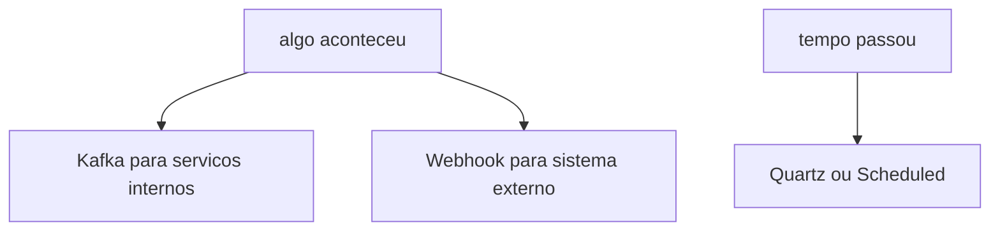

# Diagrama 7.1 — Kafka, webhook e job

## Onde você está

Leia da esquerda para a direita. Esta sessão está na **semana 07**. Foco: qual caminho para qual problema.

## Figura

Evento não espera relógio. Relógio não substitui o evento rápido.

## O que observar

Compare os nomes desta figura com os nomes reais do código e do Compose (`api-gateway`, `orders.events`, portas 11000+). Se um nome divergir, anote: ou o diagrama está velho, ou você está olhando outro ambiente.

## Exercício

Redesenhe esta figura sem olhar, em papel ou Mermaid. Depois abra de novo e marque o que esqueceu.

## Próximo arquivo

[diagrama-02-quartz.md](diagrama-02-quartz.md)
