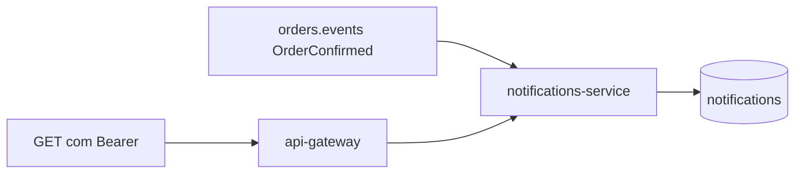

# Lab 7.1 — Ver a notificação do oráculo

Tempo previsto: **60 min**. Semana 7. Pré-requisito: meta 7.1.

## Onde você está


Leia da esquerda para a direita. Esta sessão está na **semana 07**. Foco: GET e Mongo.


## Figura desta sessão



Leia a figura antes do texto. O texto só nomeia o que a figura já mostrou.

## Objetivo

Provar que o estado final gerou registro, pela API e pelo banco.

## 1. Implementar

1. Nada de webhook ainda.

## 2. Ver manualmente

1. Pedido CONFIRMED. GET de notificações por orderId.
2. mongosh no database notifications.
3. Pedido CANCELLED por pagamento. Deve haver notificação também.

## 3. Validar o fluxo integrado

1. O orderId da API, do Kafka e da notificação é o mesmo.
2. A UI da web não lista isso. Escreva essa lacuna.

## 4. Automatizar

1. O smoke completo do repo passa a checar este GET. Leia `scripts/smoke.ps1` quando chegar na semana 10. Hoje, faça na mão.

## 5. Evoluir

1. A porta 11007 sem token também responde, porque o serviço não tem segurança própria. Anote como risco, não como feature para copiar.

## Comandos — Windows (PowerShell)

```powershell
curl.exe -s http://localhost:11001/api/health
```

## Comandos — Linux / WSL

```bash
curl -s http://localhost:11001/api/health
```

## Erros comuns

- Esperar notificação de OrderCreated. O listener ignora esse tipo.
- Chamar a rota sem Bearer no gateway e anotar 401 como 'não gerou'.

## Pistas (leia só se travar)

- Direto no serviço: http://localhost:11007/api/notifications — só para ver o risco.

A solução comentada não fica neste arquivo. Se precisar de gabarito, olhe o comportamento do oráculo (este repositório) e a fonte oficial. Não copie um serviço inteiro.

## Perguntas

- Por que a UI não basta para testar notificação?

## Entregável

Dois GETs: um CONFIRMED e um CANCELLED, com os corpos.

## Rubrica

Aprovado se os dois existem e você cita o risco da porta 11007.

## Próximo arquivo

[lab-02-job-timeout.md](lab-02-job-timeout.md)
