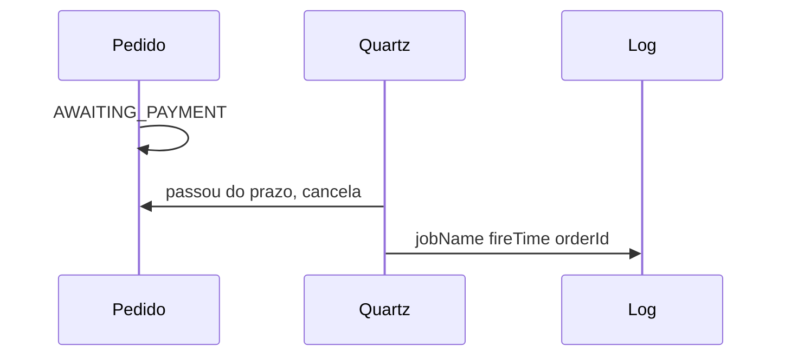

# Lab 7.2 — Job que cancela pedido parado

Tempo previsto: **100 min**. Semana 7. Pré-requisito: metas 7.3 a 7.5.

## Onde você está


Leia da esquerda para a direita. Esta sessão está na **semana 07**. Foco: Quartz no espelho.


## Figura desta sessão



Leia a figura antes do texto. O texto só nomeia o que a figura já mostrou.

## Objetivo

Um pedido que você deixou preso muda para cancelado sem você chamar outra API, depois do intervalo curto do lab.

## 1. Implementar

1. No espelho, grave pedidos com status e `updatedAt`.
2. Configure um job Quartz (não só @Scheduled) com intervalo de 15 a 30 segundos.
3. Mantenha um @Scheduled separado que só loga 'estou vivo', para você sentir a diferença.
4. O job de expiração cancela se o status for de espera e a idade passou do prazo do lab (também curto, 20 segundos).
5. Log inclui `jobName`, `fireTime`, `orderId`.

## 2. Ver manualmente

1. Crie um pedido preso (sem publicar pagamento).
2. Não chame cancelar na mão.
3. Espere o intervalo e leia o status.
4. Veja o log.

## 3. Validar o fluxo integrado

1. O orderId do log é o do GET.
2. Se você tiver Kafka no espelho, o cancelamento também pode publicar `OrderCancelled`. Se ainda não tiver, o documento basta e você anota a dívida.

## 4. Automatizar

1. Rode o job duas vezes sobre o mesmo pedido já cancelado. A segunda execução não pode 'cancelar de novo' mudando motivo ou estoque duas vezes.
2. Teste automatizado com intervalo curto ou relógio injetado.

## 5. Evoluir

1. Suba duas instâncias só se o JobStore for compartilhado; senão escreva que o cluster fica para a semana 11 e por quê.

## Comandos — Windows (PowerShell)

```powershell
# espelho na porta combinada no README
```

## Comandos — Linux / WSL

```bash
# espelho
```

## Erros comuns

- Prazo de 1 hora no lab e você achar que o job não existe.
- Cancelar todo pedido, inclusive o CONFIRMED, porque a query esqueceu o status.

## Pistas (leia só se travar)

- Filtro: status intermediário E idade > prazo.

A solução comentada não fica neste arquivo. Se precisar de gabarito, olhe o comportamento do oráculo (este repositório) e a fonte oficial. Não copie um serviço inteiro.

## Perguntas

- O que prova que foi o job e não você?

## Entregável

Log + status final, e teste de rodar duas vezes.

## Rubrica

Aprovado se a segunda execução é inócua e o log tem os três campos.

## Próximo arquivo

[lab-03-idempotencia-do-job.md](lab-03-idempotencia-do-job.md)
