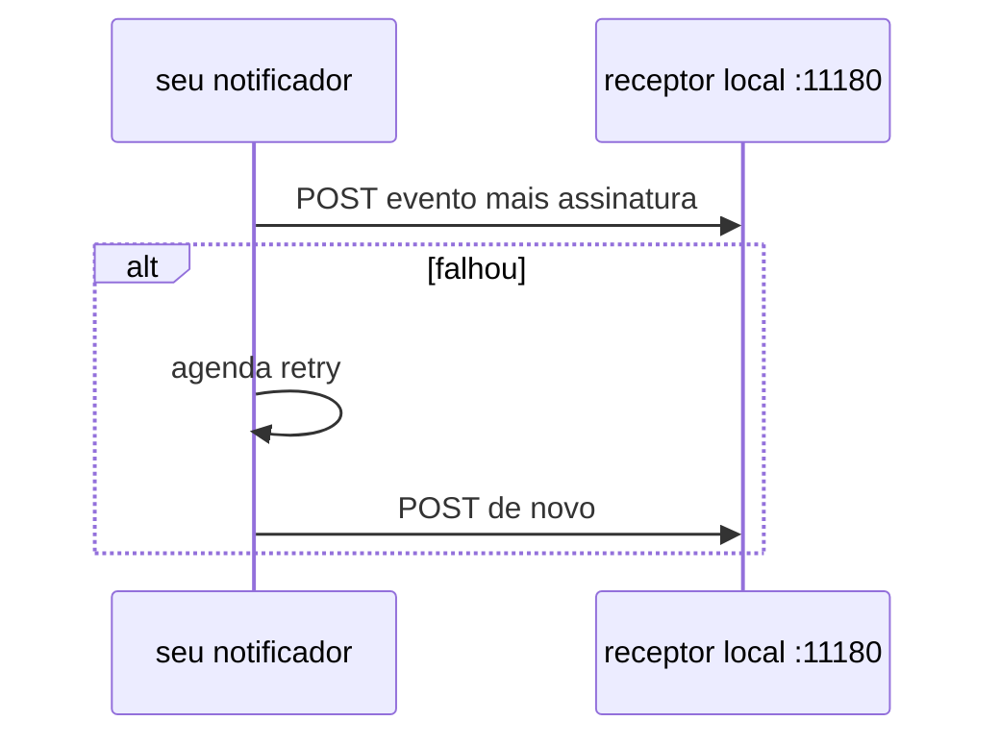

# Lab 7.3 — Webhook local e retry

Tempo previsto: **90 min**. Semana 7. Pré-requisito: lab 7.2 e meta 7.2.

## Onde você está


Leia da esquerda para a direita. Esta sessão está na **semana 07**. Foco: receptor na sua máquina.


## Figura desta sessão



Leia a figura antes do texto. O texto só nomeia o que a figura já mostrou.

## Objetivo

Entregar um POST assinado num receptor seu e não entregar duas vezes o efeito quando o retry acontece.

## 1. Implementar

1. Suba um receptor mínimo que grava os POSTs em memória e tem uma rota para listá-los.
2. Uma flag de teste faz os dois primeiros POSTs falharem.
3. O notificador tenta de novo com limite (por exemplo 3) e intervalo crescente.
4. O receptor ignora assinatura inválida com 401.

## 2. Ver manualmente

1. Dispare um evento. Veja a lista do receptor.
2. Force falha e veja mais de uma tentativa no log, e um único efeito se o receptor deduplica pelo id do evento.

## 3. Validar o fluxo integrado

1. O orderId está no corpo.
2. Tentativa esgotada fica registrada para a DLQ da semana 9, mesmo que a DLQ ainda seja uma coleção `webhook_dead`.

## 4. Automatizar

1. Teste: assinatura errada não entra. Teste: duas entregas do mesmo id só criam um registro de negócio.

## 5. Evoluir

1. Não aponte o webhook para a internet. Só localhost.

## Comandos — Windows (PowerShell)

```powershell
# receptor em 127.0.0.1:11180
```

## Comandos — Linux / WSL

```bash
# receptor em 127.0.0.1:11180
```

## Erros comuns

- Retry sem limite.
- Assinatura só no query string, vazando em log de proxy.

## Pistas (leia só se travar)

- Header `X-Signature` com HMAC SHA-256 do corpo e um segredo de lab no YAML.

A solução comentada não fica neste arquivo. Se precisar de gabarito, olhe o comportamento do oráculo (este repositório) e a fonte oficial. Não copie um serviço inteiro.

## Perguntas

- Qual id você usa para deduplicar: offset do Kafka ou id do evento de negócio?

## Entregável

Lista do receptor e um teste de assinatura inválida.

## Rubrica

Aprovado se o efeito de negócio aparece uma vez e a tentativa falha fica visível.

## Próximo arquivo

[leitura-01-jobs.md](leitura-01-jobs.md)
