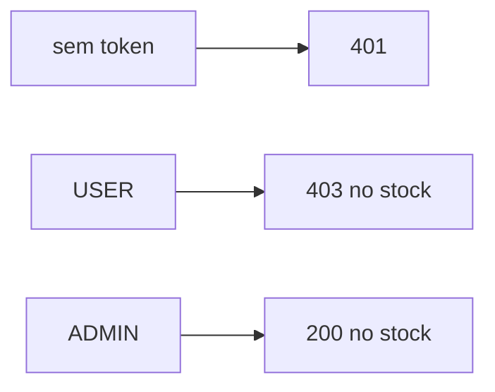

# Lab 8.1 — Executar a matriz

Tempo previsto: **70 min**. Semana 8. Pré-requisito: meta 8.1.

## Onde você está


Leia da esquerda para a direita. Esta sessão está na **semana 08**. Foco: tabela rota × papel × status.


## Figura desta sessão



Leia a figura antes do texto. O texto só nomeia o que a figura já mostrou.

## Objetivo

Preencher a tabela da segurança com status reais.

## 1. Implementar

1. Use Bruno ou curl. A coleção tem login, login-admin e os pedidos novos de 401.

## 2. Ver manualmente

1. Para cada linha de `docs/seguranca.md`, execute e escreva o status que voltou.
2. Inclua notifications com e sem token.
3. Na UI, esconda não é teste: chame o PUT como qa mesmo sem ver o menu.

## 3. Validar o fluxo integrado

1. O status da UI (menu oculto) e o status da API (403) contam histórias diferentes. Escreva as duas.

## 4. Automatizar

1. Rode `scripts/smoke.ps1`. Ele já cobre uma parte. A tabela completa continua manual nesta semana.

## 5. Evoluir

1. Não commite token no relatório. Status basta.

## Comandos — Windows (PowerShell)

```powershell
.\scripts\smoke.ps1
```

## Comandos — Linux / WSL

```bash
./scripts/smoke.sh
```

## Erros comuns

- Token velho no Bruno e 401 falso.
- Testar stock sem Content-Type e anotar 415 como 403.

## Pistas (leia só se travar)

- Olhe o corpo do 401. O gateway devolve JSON, não página HTML.

A solução comentada não fica neste arquivo. Se precisar de gabarito, olhe o comportamento do oráculo (este repositório) e a fonte oficial. Não copie um serviço inteiro.

## Perguntas

- Qual linha da matriz o smoke ainda não cobre?

## Entregável

Tabela preenchida com status observados.

## Rubrica

Aprovado se 401, 403 e 200 do estoque estão corretos.

## Próximo arquivo

[lab-02-keycloak.md](lab-02-keycloak.md)
