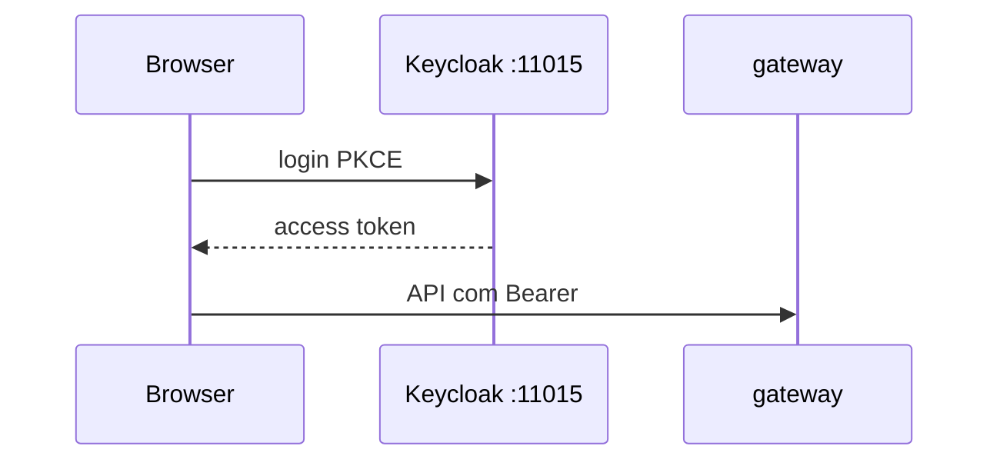

# Lab 8.2 — Entrar pelo Keycloak

Tempo previsto: **80 min**. Semana 8. Pré-requisito: tutorial 02.

## Onde você está


Leia da esquerda para a direita. Esta sessão está na **semana 08**. Foco: OIDC.


## Figura desta sessão



Leia a figura antes do texto. O texto só nomeia o que a figura já mostrou.

## Objetivo

A mesma API de produtos aceita token do Keycloak quando o overlay está ligado.

## 1. Implementar

1. Siga o tutorial 02 para subir o overlay. Não invente outro caminho.
2. Volte ao modo local ao terminar, para os outros labs não quebrarem.

## 2. Ver manualmente

1. Abra a UI e use o botão Keycloak.
2. Entre como qa.
3. Abra um produto. A chamada tem Bearer.
4. Decodifique o token e ache a role.

## 3. Validar o fluxo integrado

1. GET produtos com esse token retorna 200.
2. PUT estoque com qa continua 403.

## 4. Automatizar

1. Não automatize OIDC nesta semana. Anote que o smoke padrão é do momento 1.

## 5. Evoluir

1. Pare o overlay e confirme que `/api/auth/login` voltou.

## Comandos — Windows (PowerShell)

```powershell
# ver docs/tutoriais/02-oidc-keycloak.md
```

## Comandos — Linux / WSL

```bash
# ver docs/tutoriais/02-oidc-keycloak.md
```

## Erros comuns

- Esquecer de rebuild da web com VITE_AUTH_MODE=oidc e achar que o botão sumiu por bug do Keycloak.
- Bruno apontando para `/api/auth/login` durante o modo OIDC.

## Pistas (leia só se travar)

- O tutorial diz como subir o compose com os dois arquivos `-f`.

A solução comentada não fica neste arquivo. Se precisar de gabarito, olhe o comportamento do oráculo (este repositório) e a fonte oficial. Não copie um serviço inteiro.

## Perguntas

- O que mudou no `iss` do token em relação ao momento 1?

## Entregável

Frase comparando os dois `iss` e print do catálogo logado via Keycloak.

## Rubrica

Aprovado se produtos retornam 200 com token do Keycloak e você desligou o overlay no final.

## Próximo arquivo

[lab-03-quebrar-mtls.md](lab-03-quebrar-mtls.md)
