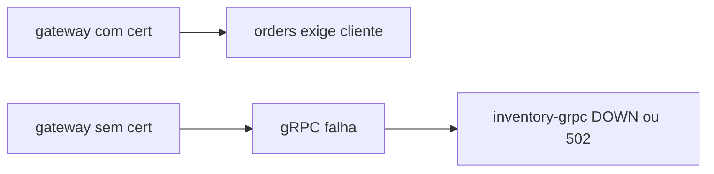

# Lab 8.3 — Quebrar a confiança do certificado

Tempo previsto: **80 min**. Semana 8. Pré-requisito: tutorial 03.

## Onde você está


Leia da esquerda para a direita. Esta sessão está na **semana 08**. Foco: mTLS negativo.


## Figura desta sessão



Leia a figura antes do texto. O texto só nomeia o que a figura já mostrou.

## Objetivo

Provar que sem certificado a chamada interna cai, e restaurar depois.

## 1. Implementar

1. Siga o tutorial 03 ao pé da letra, inclusive a parte de restaurar.
2. Não gere certificado novo se o de `infra/certs` já sobe.

## 2. Ver manualmente

1. Caminho feliz com mTLS: produtos 200 e health com gRPC UP.
2. Quebre como o tutorial manda.
3. Veja a falha.
4. Restaure e veja 200 de novo.

## 3. Validar o fluxo integrado

1. JWT ainda é exigido na borda durante o teste feliz. mTLS não remove o 401.
2. Anote os dois controles no relatório.

## 4. Automatizar

1. O validador `scripts/academy/validate-mtls.ps1` só checa se os arquivos do overlay existem no oráculo. A execução é sua.

## 5. Evoluir

1. Não commite chave privada nova. As de lab já estão versionadas de propósito.

## Comandos — Windows (PowerShell)

```powershell
# ver docs/tutoriais/03-mtls-grpc.md
```

## Comandos — Linux / WSL

```bash
# ver docs/tutoriais/03-mtls-grpc.md
```

## Erros comuns

- Deixar o overlay quebrado e o próximo smoke falhar sem você lembrar.
- Apagar `ca.key`.

## Pistas (leia só se travar)

- `openssl x509 -in infra/certs/orders.crt -noout -subject` mostra o nome do certificado.

A solução comentada não fica neste arquivo. Se precisar de gabarito, olhe o comportamento do oráculo (este repositório) e a fonte oficial. Não copie um serviço inteiro.

## Perguntas

- mTLS substitui o login do qa?

## Entregável

Nota: feliz, quebrado, restaurado, com os status.

## Rubrica

Aprovado se você voltou ao estado em que o lab sobe de novo.

## Próximo arquivo

[leitura-01-identidade.md](leitura-01-identidade.md)
