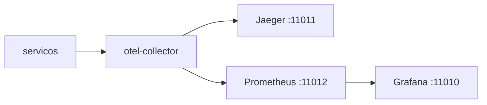

# Lab 9.1 — Dois traces: feliz e falha

Tempo previsto: **80 min**. Semana 9. Pré-requisito: meta 9.1.

## Onde você está


Leia da esquerda para a direita. Esta sessão está na **semana 09**. Foco: Jaeger.


## Figura desta sessão



Leia a figura antes do texto. O texto só nomeia o que a figura já mostrou.

## Objetivo

Comparar o trace do pedido feliz com o do pagamento forçado.

## 1. Implementar

1. Não implemente trace no espelho neste lab se o tempo apertar. Observe o oráculo. O checkpoint de observabilidade pede o espelho depois, com pelo menos logs estruturados.

## 2. Ver manualmente

1. Pedido feliz. Ache o trace. Anote serviços que aparecem.
2. Pedido com falha de pagamento. Anote o que muda.
3. No Prometheus, abra a query `up` e diga quais jobs estão 1.

## 3. Validar o fluxo integrado

1. O orderId pode não estar no span. Correlacione por horário e pelo log. Escreva essa limitação.
2. Grafana: abra o dashboard StudyShop e diga o que o painel `up` mostra.

## 4. Automatizar

1. Preencha o template `docs/academia-qa/evidencias/templates/evidencia-trace-jaeger.md` duas vezes.

## 5. Evoluir

1. Se não houver trace, confira `OTEL_EXPORTER_OTLP_ENDPOINT` e se o collector está de pé. Não desligue o export 'para sumir o erro'.

## Comandos — Windows (PowerShell)

```powershell
Start-Process http://localhost:11011
```

## Comandos — Linux / WSL

```bash
xdg-open http://localhost:11011 || true
```

## Erros comuns

- Olhar trace de ontem.
- Query `up` sem resultado porque o Prometheus não alcança o nome Docker (você está fora da rede: use a UI, que já está configurada).

## Pistas (leia só se travar)

- docs/observabilidade.md tem o passo a passo das URLs.

A solução comentada não fica neste arquivo. Se precisar de gabarito, olhe o comportamento do oráculo (este repositório) e a fonte oficial. Não copie um serviço inteiro.

## Perguntas

- Os dois traces deveriam ser idênticos?

## Entregável

Template de trace preenchido para os dois cenários.

## Rubrica

Aprovado se você aponta uma diferença concreta entre feliz e falha.

## Próximo arquivo

[lab-02-dlq.md](lab-02-dlq.md)
