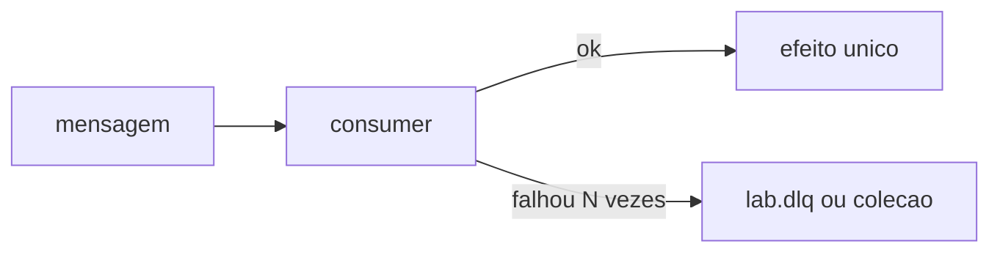

# Lab 9.2 — Falhar de propósito e cair na DLQ

Tempo previsto: **90 min**. Semana 9. Pré-requisito: meta 9.3.

## Onde você está


Leia da esquerda para a direita. Esta sessão está na **semana 09**. Foco: DLQ no espelho.


## Figura desta sessão



Leia a figura antes do texto. O texto só nomeia o que a figura já mostrou.

## Objetivo

Uma mensagem ruim não gira para sempre e fica visível.

## 1. Implementar

1. No espelho, o consumer de um tópico de lab falha se o payload tiver `forceError: true`.
2. Depois de 3 tentativas, grave na DLQ com orderId, erro e payload.
3. Loge cada tentativa.

## 2. Ver manualmente

1. Publique uma mensagem boa e uma ruim.
2. A boa aplica efeito uma vez.
3. A ruim aparece na DLQ e para.

## 3. Validar o fluxo integrado

1. O orderId da DLQ é o da mensagem original.
2. O tópico principal não cresce sem limite por causa do retry (não re-publique no mesmo tópico sem controle).

## 4. Automatizar

1. Teste automatizado com broker de teste ou com a coleção DLQ, assertindo 1 documento depois de N tentativas.

## 5. Evoluir

1. Conte tentativas. Se passar de 3, o teste falha.

## Comandos — Windows (PowerShell)

```powershell
# espelho
```

## Comandos — Linux / WSL

```bash
# espelho
```

## Erros comuns

- Catch vazio.
- Re-publicar no mesmo tópico e criar loop.

## Pistas (leia só se travar)

- Tópico separado `lab.dlq` ou coleção `dead_letters`.

A solução comentada não fica neste arquivo. Se precisar de gabarito, olhe o comportamento do oráculo (este repositório) e a fonte oficial. Não copie um serviço inteiro.

## Perguntas

- Como você vê a DLQ sem debugger?

## Entregável

Evidência da mensagem boa e da ruim.

## Rubrica

Aprovado se a ruim para sozinha e é listável.

## Próximo arquivo

[lab-03-replay.md](lab-03-replay.md)
