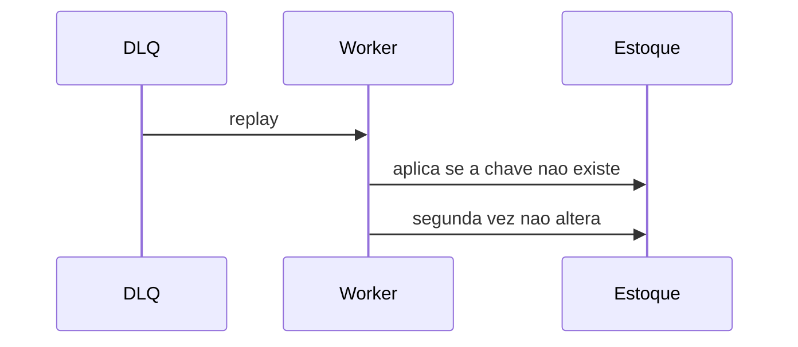

# Lab 9.3 — Replay idempotente

Tempo previsto: **80 min**. Semana 9. Pré-requisito: lab 9.2 e meta 9.4.

## Onde você está


Leia da esquerda para a direita. Esta sessão está na **semana 09**. Foco: reprocessar sem duplicar.


## Figura desta sessão



Leia a figura antes do texto. O texto só nomeia o que a figura já mostrou.

## Objetivo

Reprocessar a mesma mensagem não muda o estoque duas vezes.

## 1. Implementar

1. Guarde a chave orderId+efeito antes de aplicar.
2. Um comando ou endpoint de lab `POST /lab/replay/{id}` tira da DLQ e processa.
3. Chame duas vezes.

## 2. Ver manualmente

1. Estoque depois da primeira vez anotado.
2. Estoque depois da segunda igual.
3. Log diz 'já aplicado' na segunda.

## 3. Validar o fluxo integrado

1. A mensagem de DLQ e o estoque referenciam o mesmo id.

## 4. Automatizar

1. Teste JUnit ou script com os dois números.

## 5. Evoluir

1. Não faça replay automático em loop. Um comando explícito.

## Comandos — Windows (PowerShell)

```powershell
# curl do replay no README do espelho
```

## Comandos — Linux / WSL

```bash
# curl do replay
```

## Erros comuns

- Apagar a chave no sucesso e a segunda vez aplicar de novo.
- Replay em produção apontando para o oráculo.

## Pistas (leia só se travar)

- A chave fica no Mongo do espelho, coleção `applied_effects`.

A solução comentada não fica neste arquivo. Se precisar de gabarito, olhe o comportamento do oráculo (este repositório) e a fonte oficial. Não copie um serviço inteiro.

## Perguntas

- Por que a segunda chamada ainda retorna 200 e não 500?

## Entregável

Teste verde com estoque estável.

## Rubrica

Aprovado se a segunda aplicação não altera o número.

## Próximo arquivo

[leitura-01-obs.md](leitura-01-obs.md)
