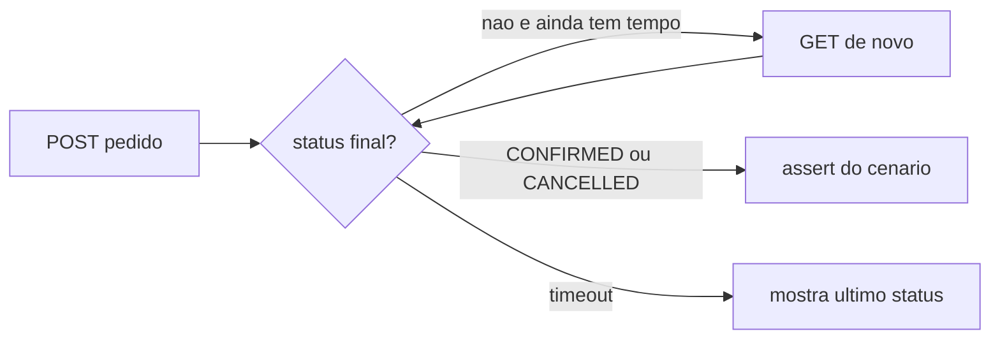

# Diagrama 10.2 — Espera do estado final

## Onde você está

Leia da esquerda para a direita. Esta sessão está na **semana 10**. Foco: não assertar o meio.

## Figura

O loop tem teto. A falha mostra o último status, não só 'timeout'.

## O que observar

Compare os nomes desta figura com os nomes reais do código e do Compose (`api-gateway`, `orders.events`, portas 11000+). Se um nome divergir, anote: ou o diagrama está velho, ou você está olhando outro ambiente.

## Exercício

Redesenhe esta figura sem olhar, em papel ou Mermaid. Depois abra de novo e marque o que esqueceu.

## Próximo arquivo

Semana 11.
