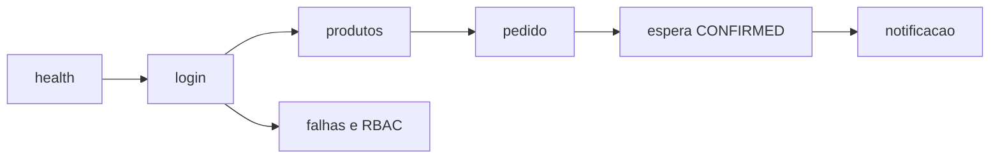

# Lab 10.1 — Rodar o smoke até o estado final

Tempo previsto: **70 min**. Semana 10. Pré-requisito: scripts de smoke.

## Onde você está


Leia da esquerda para a direita. Esta sessão está na **semana 10**. Foco: oráculo.


## Figura desta sessão



Leia a figura antes do texto. O texto só nomeia o que a figura já mostrou.

## Objetivo

Ver a suíte de API do oráculo passar, incluindo espera da saga.

## 1. Implementar

1. Não reescreva o script se ele já cobre os casos. Leia-o e rode.
2. Se um passo falhar, conserte o ambiente antes de 'pular o assert'.

## 2. Ver manualmente

1. `.\scripts\smoke.ps1` ou `./scripts/smoke.sh`.
2. Leia cada linha que o script imprime.
3. Confira que ele espera status final e busca notificação.

## 3. Validar o fluxo integrado

1. O orderId impresso existe no Kafka UI.
2. O 401 sem token e o 403 do qa estão na saída.

## 4. Automatizar

1. O comando é o próprio script. Você não copia o curl para outro lugar sem necessidade.

## 5. Evoluir

1. Anote a duração. Se passar de 3 minutos, olhe qual passo esperou demais.

## Comandos — Windows (PowerShell)

```powershell
.\scripts\smoke.ps1
```

## Comandos — Linux / WSL

```bash
./scripts/smoke.sh
```

## Erros comuns

- Stack no meio do boot.
- Estoque zerado por testes anteriores sem reset. Use `scripts/qa-reset` se precisar do seed.

## Pistas (leia só se travar)

- Timeout padrão 60s. Variável de ambiente documentada no cabeçalho do script.

A solução comentada não fica neste arquivo. Se precisar de gabarito, olhe o comportamento do oráculo (este repositório) e a fonte oficial. Não copie um serviço inteiro.

## Perguntas

- Qual passo o smoke antigo (só o POST) não provava?

## Entregável

Saída com Smoke OK.

## Rubrica

Aprovado se CONFIRMED, CANCELLED de pagamento e CANCELLED de estoque aparecem na saída.

## Próximo arquivo

[lab-02-playwright-login.md](lab-02-playwright-login.md)
