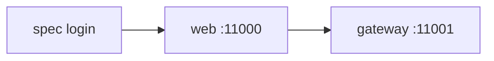

# Lab 10.2 — Login e menu de admin na UI

Tempo previsto: **80 min**. Semana 10. Pré-requisito: meta 10.1.

## Onde você está


Leia da esquerda para a direita. Esta sessão está na **semana 10**. Foco: Playwright.


## Figura desta sessão



Leia a figura antes do texto. O texto só nomeia o que a figura já mostrou.

## Objetivo

Automatizar o que você viu no DevTools na semana 1: qa não vê estoque, admin vê.

## 1. Implementar

1. Os specs já estão em `apps/web/e2e`. Leia `login-rbac.spec.ts` antes de rodar.
2. Instale o browser do Playwright uma vez: `npx playwright install chromium` dentro de `apps/web`.

## 2. Ver manualmente

1. Suba a stack.
2. `npm run e2e` em `apps/web`, ou só o spec de login.
3. Abra o relatório HTML se falhar.

## 3. Validar o fluxo integrado

1. O spec usa `data-testid`, não texto solto traduzível, sempre que o mapa em `docs/cenarios-qa.md` tem id.
2. Se você adicionar um spec, use os mesmos ids.

## 4. Automatizar

1. O comando fica no `package.json` como `e2e`.

## 5. Evoluir

1. Não aumente timeout global para 5 minutos. Ajuste a espera do elemento que falta.

## Comandos — Windows (PowerShell)

```powershell
cd apps/web
npm run e2e -- e2e/login-rbac.spec.ts
```

## Comandos — Linux / WSL

```bash
cd apps/web
npm run e2e -- e2e/login-rbac.spec.ts
```

## Erros comuns

- Web ainda em splash e o testid não apareceu.
- Stack em modo OIDC e o formulário local não existe. O spec assume momento 1.

## Pistas (leia só se travar)

- `npx playwright show-report` abre o trace.

A solução comentada não fica neste arquivo. Se precisar de gabarito, olhe o comportamento do oráculo (este repositório) e a fonte oficial. Não copie um serviço inteiro.

## Perguntas

- Por que o spec não procura a palavra Estoque no CSS e sim `nav-admin-stock`?

## Entregável

Spec verde.

## Rubrica

Aprovado se qa sem menu e admin com menu passam no mesmo arquivo.

## Próximo arquivo

[lab-03-playwright-pedido.md](lab-03-playwright-pedido.md)
