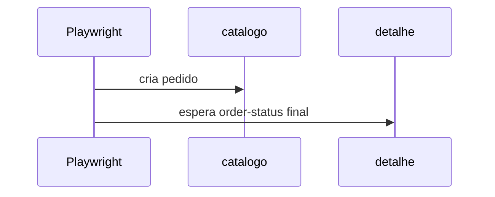

# Lab 10.3 — Pedido feliz e falhas na UI

Tempo previsto: **90 min**. Semana 10. Pré-requisito: lab 10.2.

## Onde você está


Leia da esquerda para a direita. Esta sessão está na **semana 10**. Foco: estado final na tela.


## Figura desta sessão



Leia a figura antes do texto. O texto só nomeia o que a figura já mostrou.

## Objetivo

A UI chega em CONFIRMED, em CANCELLED por pagamento e em CANCELLED por estoque.

## 1. Implementar

1. Leia os specs de pedido. Eles esperam o testid `order-status`.
2. O de estoque insuficiente repõe `prod-raro` via API admin antes, para não depender da sujeira anterior.

## 2. Ver manualmente

1. Rode a pasta `e2e`.
2. Se um spec falhar, abra o trace e o último status visto.

## 3. Validar o fluxo integrado

1. Confira no log do Playwright o orderId.
2. Busque esse id na Kafka UI uma vez, para ligar UI e evento.

## 4. Automatizar

1. Mantenha os quatro fluxos: login/RBAC, feliz, pagamento, estoque, e o admin salvando estoque.
2. Não duplique o smoke inteiro na UI.

## 5. Evoluir

1. Flaky: olhe se você assertou estado intermediário. Troque para esperar o final.

## Comandos — Windows (PowerShell)

```powershell
cd apps/web
npm run e2e
```

## Comandos — Linux / WSL

```bash
cd apps/web && npm run e2e
```

## Erros comuns

- `prod-raro` com estoque 0.
- Clicar em adicionar uma vez só e a quantidade ficar 1, então o pedido confirma em vez de rejeitar.

## Pistas (leia só se travar)

- O spec adiciona o raro duas vezes. Leia o código antes de mudar o produto.

A solução comentada não fica neste arquivo. Se precisar de gabarito, olhe o comportamento do oráculo (este repositório) e a fonte oficial. Não copie um serviço inteiro.

## Perguntas

- Qual assert está na UI e qual continua só na API?

## Entregável

Suíte e2e verde com a stack no ar.

## Rubrica

Aprovado se os três finais de pedido passam.

## Próximo arquivo

[leitura-01-automacao.md](leitura-01-automacao.md)
