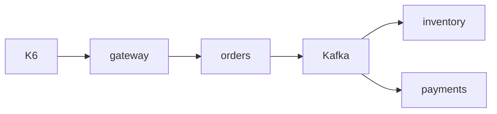

# Diagrama 11.1 — O que a carga atravessa

## Onde você está

Leia da esquerda para a direita. Esta sessão está na **semana 11**. Foco: não é só o gateway.

## Figura

Gargalo pode ser o consumidor, não o HTTP que o k6 chama.

## O que observar

Compare os nomes desta figura com os nomes reais do código e do Compose (`api-gateway`, `orders.events`, portas 11000+). Se um nome divergir, anote: ou o diagrama está velho, ou você está olhando outro ambiente.

## Exercício

Redesenhe esta figura sem olhar, em papel ou Mermaid. Depois abra de novo e marque o que esqueceu.

## Próximo arquivo

[diagrama-02-job-lento.md](diagrama-02-job-lento.md)
