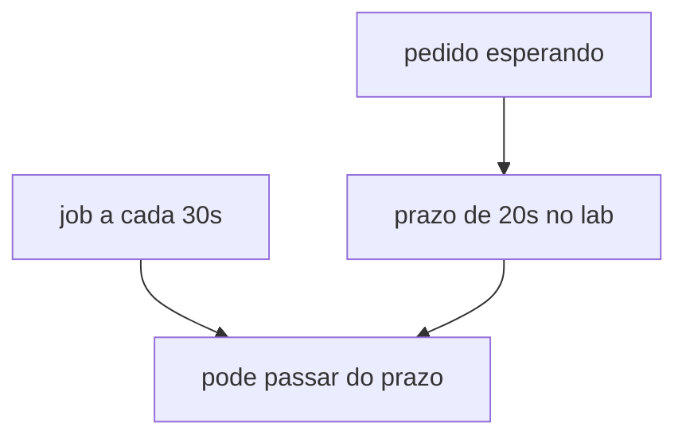

# Diagrama 11.2 — Job lento e o prazo do pedido

## Onde você está

Leia da esquerda para a direita. Esta sessão está na **semana 11**. Foco: SLA do relógio.

## Figura

Se o intervalo do job é maior que o prazo, o cancelamento atrasa. Os dois números precisam ser lidos juntos.

## O que observar

Compare os nomes desta figura com os nomes reais do código e do Compose (`api-gateway`, `orders.events`, portas 11000+). Se um nome divergir, anote: ou o diagrama está velho, ou você está olhando outro ambiente.

## Exercício

Redesenhe esta figura sem olhar, em papel ou Mermaid. Depois abra de novo e marque o que esqueceu.

## Próximo arquivo

Semana 12.
